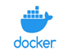
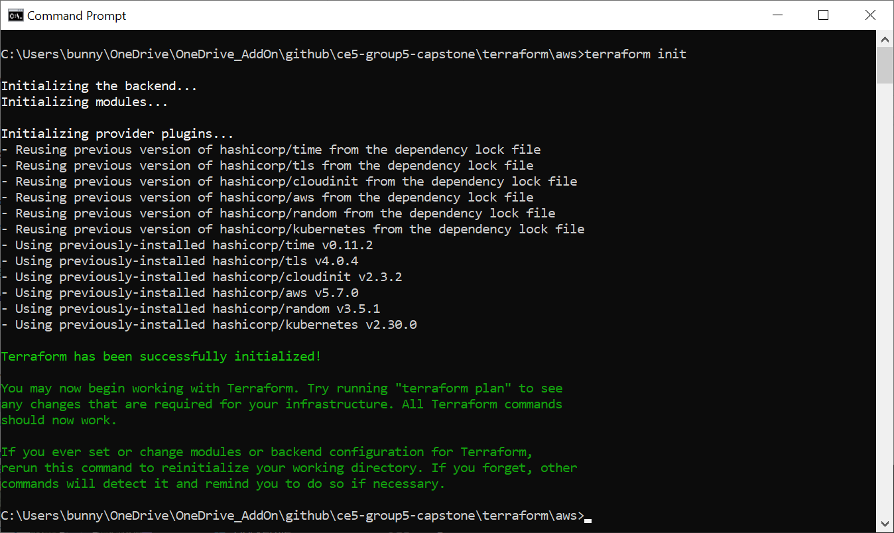
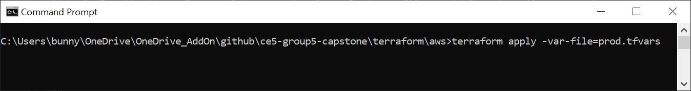
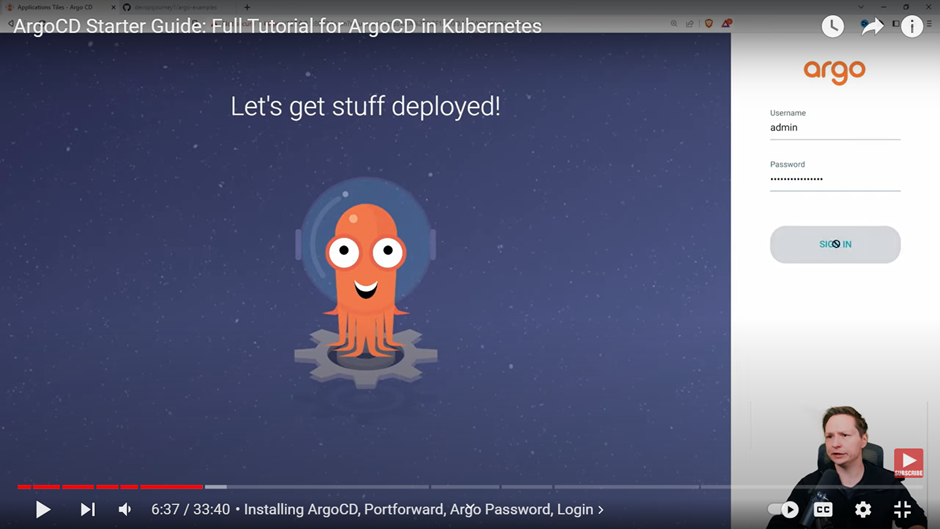

# NTU-SCTP Cloud Infrastructure Engineering
## Cohort 5 Group 5 Capstone Project<br>
Submitted By: __SOON Leah Foo__<br>
Submitted On: __15 Jun 2024__

##  A. Project Title

## Machine Learning Operations using GitHub Actions with automated deployment to instrumented Kubernetes clusters.

##  B. Business Use Case

Data Driven Cloud Consultancy Services is a company that specialises in providing customised AI-powered cloud solutions to its clients.

We have been approached by one of our prospective client which is a small-medium-sized company specialising in producting paper boxes in their factories.

In order to ensure the machines are operationally healthy and functioning on a daily basis, the company has to schedule for planned maintenance of the machinery on a regular basis.

The company has more than 20 different makes and models of machineries used in the fabrication process, and it has always been daunting for the company to monitor the operational status of the various machines, to ensure there is minimal downtime due to breakdown and faults in the machines.

The company thus approached us for professional advice and assessment whether there are cost-effective ways to schedule for preventive maintenance and to reduce any impact caused by machine breakdown.

##  C. Project Proposal

Corrective and preventive maintenance is often a major part of manufacturing industries. Although this process is complex and expensive when conducted with conventional approaches, machine learning has now made it easier to discover meaningful insights and hidden patterns in factory data.

Because this process helps in reducing risks associated with unexpected failures, companies can also reduce unnecessary expenses by implementing machine learning models (ML models). What’s more, artificial intelligence and machine learning algorithms work in collaboration to analyze historical data and ensure workflow visualization.

Below is a summary of our proposal:

1. We will conduct on-site survey of their factories and assessed the position(s) on each of the machines where sensors/IoT devices can be attached to capture data on temperature, sound, humidity, rotation speed, and other statistics that can help to detect fault in the machine.

2. These sensor data will be collected and uploaded to the cloud and stored in AWS S3 bucket.

3. The data in S3 will be cleaned and pre-processecd to remove any invalid data.

4. We will load the data in the S3 buckets to train and build a ML model which is able to predict whether the machine that produced the data is about to fail or require any attention for corrective maintenance.

5. The trained ML models will be containerised and deployed as RESTAPI endpoints to Kubernetes clusters.

6.	We will automate the deployment process to ensure the ML model in the production environment can be easily updated whenever there are new releases of the ML models.

7.	We will install instrumenting software tools such as Prometheus and ML-Monitor to monitor the health status and predictive accuracy of the deployed ML model. If the predictive accuracy drops below the acceptable threshold limit, we will trigger the process to retrain the ML model, if necessary.

Here is a summary of the proposed items:

### _Summary Of Proposed Solution_
Image Source: https://igboie.medium.com/kubernetes-ci-cd-with-github-github-actions-and-argo-cd-36b88b6bda64


##
|S/N|Proposed item<br>(Technology stack) |Description of proposed items|
|---|------------------------------------|-----------------------------| 
|c1 |GitHub Actions<br>(CI pipeline)  |GitHub Actions is used to implement a CI pipeline to create the ML model.|
|c2 |Docker/REST API<br>(Containerisation/Microservice)|The ML models created in __(c1)__ are containerised using Docker and published to DockerHub. The images are implemented as REST API services using Python/Flask.|
|c3	|Kubernetes<br>(Orchestration platform)     |The services in __(c2)__ are deployed to Elastic Kubernetes Service (EKS) of AWS using Terraform.<br>EKS is a managed service and thus will handle the auto-scaling, self-healing and auto-provisioning of the required resources for us.|
|c4	|GitOps<br>(CD workflow automation)|The configurations of EKS deployed in __(c3)__ is stored in a config repository.<br>ArgoCD is setup to monitor if there are changes to this config repository. Wnenever it detects any updates to the ML model versions and/or other settings such as number of replicas, new services added, etc, ArgoCD will refresh and propagate those changes to the Kubernetes cluster(s) automatically.|
|c5 |Prometheus/Grafana<br>(Instrumentation)|The services in __(c2)__ are also monitored based on the various performance metrics generated from them. The metrics are stored in Prometheus and visualised using Grafana.|
|||

##  D. Project Implementation Details

### D1. MLOps CI/CD Pipeline

GitHub Actions has been a very successful automation tool used by software developers to automate the software development life cycle from development stage right through to the deployment stage.

In this project, we will also leverage GitHub Actions as the tool to automate the MLOps workflow.

#### _DevOps CI/CD pipeline (Software Engineering) versus MLOps CI/CD pipeline (Machine Learning)_
 

#### _Different roles involved in MLOps workflow._


#### _MLOps workflow using GitHub Actions._
<br>


In the ML domain, the actual development or the training/fine-tuning of the program codes is usually done by a data scientist. Hence, the Trunk-based development approach (versus the more complex variation using Feature branching) is more suitable as the branching strategy for MLOps workflow.

Reference: https://www.freecodecamp.org/news/what-is-trunk-based-development/

In our MLOps workflow, there are mainly 3 events that will trigger the MLOps pipeline into action:

1.  __Push event at dev branch__

    -  The trained ML model as well as training results will saved as GitHub artifacts for audit trail purpose.

2.  __Pull request from dev branch to main branch__

    -  New pull requests to merge changes from dev to the main branch are subjected to approval by a manager/senior data scientist to validate and assess the ML model training results, which are available as GitHub artifacts.
    - Upon acceptance of the test results and approval of the pull request, the changes and the latest source codes are merged back to the main branch.
    - The ML model file (one of the files in the GitHub artifacts) will be used to build the Docker image and tagged as ml-model:latest (note that this is a developer build and not to be released to production environment) and is pushed to the DockerHub.
    - If the pull request is rejected for some reasons, the pending CI workflow/job will be cancelled by GitHub Actions and no ml-model:latest will be pushed to the DockerHub.

3.  __Release event on the main branch with vx.x.x semantic version tag__

    - This is a step that requires due diligence on the testing/QA team to schedule the deployment of the release version of the ML model to the production environment.
    - Upon creation of the release tag, the event will trigger the CD process:
        - Push to DockerHub with 2 images with respective tag of latest and vx.x.x.
        - Update the values.yaml file in the application config repository to the new release version vx.x.x.
        - Deployment of the release version vx.x.x of the ML model to the test/dev system is auto-sync via ArgoCD UI or CLI.
        - Deployment of the release version vx.x.x of the ML model to the production system is manually synchronised via ArgoCD UI or CLI.
    - If the release is rejected for some reasons, the pending CD workflow/job will be cancelled by GitHub Actions.

<XXXdetails><summary><code style="color: yellow">MLOps CI/CD Pipeline Demo</code></summary>

1.  __Push event at dev branch__

    - Format:
        ```
        kubectl
        ```
2.  __Pull request from dev branch to main branch__
```
```

3.  __Release event on the main branch with vx.x.x semantic version tag__
```
```
</details>

### D2. Containerisation  And Microservices 

We will containerise the model file created in the preceding step to a Docker image.

Containerisation is one of the cloud-native techologies that we should always exploit, so that our application (i.e. our ML model) is portable, deployable and easily designed for scalability.

In addition to containerising our ML Model, we have also implemented industrial standard protocol using the REST API so that our image can be easily accessed via the HTTP GET and POST method using our internet browser.

<XXXdetails><summary><code style="color: yellow">Containerisation And Microservices Demo</code></summary>

1.  Pre-requisites For Containerisation And Microservices Demo:
    - |S/N|Required software|Version|
      |---|-----------------|-------|
      | 1 | curl            |???|
      | 2 | python          |???|
      | 3 | Postman         |???|
      |||

2.  Use Postman to test the GET method.
 
    

3.  Use Postman to test the POST method.

    
</details>

### D3. Kubernetes 

We have chosen to use Elastic Kubernetes Service (EKS) which is the managed Kubernetes services of Amazon Web Services' (AWS) as the deployment platform.

EKS is the managed Kubernetes services of Amazon Web Services' (AWS) which offers high-availability, scalability and resilency for our deployed applications.

The EKS is provisioned using Terraform, which is an open-source techology to allow us to deploy infrastructure using codes.

<XXXdetails><summary><code style="color: aqua">Elastic Kubernetes Service (EKS) Deployment Demo</code></summary>

1.  Pre-requisites For EKS Deployment Demo:
    - |S/N|Required software|Version|
      |---|-----------------|-------|
      | 1 | terraform       |v1.8.4 or later.|
      | 2 | kubectl         |???|
      | 3 | AWS account with permission to provision resources.||
      | 4 | AWS credentials setup in local machine.||
      |||

2.  Navigate to the folder terraform/aws and run the `terraform init` command.

    

3.  Run the `terraform apply` command and specify `-var-file=prod.tfvars` as the argument:
    ```
    terraform apply -var-file=prod.tfvars
    ```
    

    Note that the command will provision the infrastructures (VPC, Network, Firewalls, Internet Gateway, EC2, etc) for the production environment. Please use the dev.tfvars to setup the development/testing environment.
    ```
    terraform apply -var-file=dev.tfvars
    ```
    
    
4.  Upon prompted by the system, type `yes` and then press the `Enter` key:

    

5.  Please wait for up to 20 minutes for the Terraform to provision the EKS cluster in AWS.<br>
    Upon completion of the EKS cluster, you should be able to see the information about the cluster:

    

6.  Please note down the details shown in the preceding step because the information is required in section D4 for setting up the
    ArgoCD.

7.  Run the following command to update the kubectl configuration file (Located at ~/.kube/config).<br>
    ```
    kubectl config???
    ```
    

8.  You are ready to proceed to setup the ArgoCD described in the next section.
</details>

### D4. ArgoCD 

After deployment of our ML model as an application in the Kubernetes cluster, we make use of ArgoCD to automate the continuous deployment pipeline.

ArgoCD is a declarative GitOps-based continuous deployment tool for Kubernetes. It helps us to deploy and manage applications on Kubernetes clusters in an automated, reliable and repeatable way. It does this by continuously monitoring the live state of the applications in a cluster and compares the state against the desired state defined in the GitHub repository.

Whenever a developer pushes changes to the GitHub repository, ArgoCD will detect the changes and synchronise them to the Kubernetes.

To enable GitOps to work, it is a best practice to have 2 repositories. One for the application source codes and another one for the configuration codes. The configuration codes define the assets in the Kubernetes cluster such as Deployments, Services, ConfigMap, etc. Whenever the configuration codes are updated, ArgoCD will kick in and synchronise the live versus desired states so that they are the same eventually.

However, ArgoCD is only a continuous deployment (CD) tool and we still require a pipeline for continuous integration (CI) that will test and build our application.


When a developer updates the application source codes, he will test and then build an image which will be pushed to a container repository. The CI pipeline will the trigger updates to the configuration repository (e.g. update the image version) which will cause ArgoCD to synchronise.

GitOps using ArgoCD has these benefits:
- It has the ability to enable Disaster Recovery. In DevOps world, we do not back things up anymore but recreate them instead. If we lose a Kubernetes cluster, we can just bootstrap a new cluster and point the new ArgoCD deployments to the configuration repository. Since everything is defined in codes, ArgoCD will bring up the new cluster to the desired state and we are back in business.
- It has the ability to orchestrate deployments to multiple Kubernetes clusters. ArgoCD is not bound to a single Kubernetes cluster. We can have ArgoCD installed on one cluster controlling the configurations of the other clusters. If any of these clusters were to fail, ArgoCD should be able to bring them back. In addition, if we were to lose the cluster where ArgoCD is installed, it would also be recoverable as the configuration of ArgoCD can be stored as YAML file.
- The applications deployed in the Kubernetes clusters are always synchronised with the single source of truth (i.e. the source GitHub repositories).
- We can adopt security best practice to grant access only to those who are responsible for supporting the CD pipeline.
- We can implement blue/green deployment and/or canary deployment with ease.
- We can always rollback to the previous working version should the new version is not stable.

<XXXdetails><summary><code style="color: cyan">ArgoCD Setup (Using Manifest) Demo</code></summary>

1.  Pre-requisites For ArgoCD Setup (Using Manifest) Demo:
    - |S/N|Required software|Version|
      |---|-----------------|-------|
      | 1 | kubectl         |???|
      | 2 | ArgoCD GUI and CLI tool||
      | 3 | A Kubernetes installed and configured in .kube/config.||
      |||

2.  Run the following command to create the argocd namespace.
    ```
    kubectl create namespace argocd
    ```
    

3.  Apply the install.yaml manifest file to install ArgoCD.
    ```
    kubectl apply -n argocd -f https://raw.githubusercontent.com/argoproj/argo-cd/stable/manifests/install.yaml
    ```
    

4.  Use this command to verify the installation.
    ```
    kubectl get all --namespace argocd
    ```
    

    Please wait for few minutes for all the pods to be ready in Running status. These are all the components that are required for ArgoCD to function properly.

5.  We can access ArgoCD via its Graphical User Interface (GUI). But we need to use a mechanism
    called “port-forwarding” on the service called service/argocd-server (which is listening on
    port 80 and 443). By-pass the certificate check, if necessary.
    ```
    kubectl get services -n argocd
    kubectl port-forward service/argocd-server --namespace argocd 8080:443
    ```
    

6.  Run the following command to get the initial password of ArgoCD. You will need it to login
    to the ArgoCD GUI.
    ```
    kubectl -n argocd get secret argocd-initial-admin-secret -o jsonpath="{.data.password}" | base64 -d
    ```
    

7.  Go to the browser and enter the following address as the URL to access the ArgoCD GUI.
    ```
    http://localhost:8080
    ```
8.  When the ArgoCD GUI is up, enter __admin__ as the __Username__. For the __Password__, enter
    the text that you obtained in step 6.

    

9.  Within the ArgoCD GUI, click Create Application. Please enter the following details:
    Application name: XXX
    Project: default
    __Create namespace__: Tick this option
    Repo URL: XXX
    Target server: XXX

    Then click the Create button at the bottom of the screen.

    

10. Please wait for the application to show healthy status (i.e. Synchronised/Healthy).

    

11. Repeat step 9 and 10 to create a second application, if required.


</details>

### D5. Prometheus  And Grafana 

Although Kubernetes has self-healing capability, it is not desirable if there are indeed outages in the deployed application.

Very often, we will want to monitor the ML model not only for its performance, latency and predictive accuracy, we also want to perform health check on the operating environment to give insights on whether the operating environment is working as per our expectation.

In the program codes that we used for training the ML model, we have also implemented instrumentation capability to make the model itself export relevant ML-related metrics (such as data and model drift, prediction accuracy, classification and regression metrics, etc). These metrics can then be configured in the instrumentation software for us to analyse the data for performance, operation, troubleshooting and optimisation purpose.

#### _ML Monitoring_
Image Source: https://bowtiedraptor.substack.com/p/mlops-18-monitoring-with-prometheus


#### _ML Monitoring With Prometheus And Grafana_
Image Source: https://bowtiedraptor.substack.com/p/mlops-18-monitoring-with-prometheus


<XXXdetails><summary><code style="color: yellow">Prometheus And Grafana Setup Demo</code></summary>

1.  Pre-requisites For Prometheus And Grafana Setup Demo:
    - |S/N|Required software|Version|
      |---|-----------------|-------|
      | 1 | helm            |vXXXX or later.|
      | 2 | kubectl         |???|
      | 3 | A Kubernetes installed and configured in .kube/config.||
      |||

2.  Go to https://github.com/prometheus-community/helm-charts/tree/main/charts/prometheus and locate the
    prometheus chart.

    

3.  Run the following command to add the prometheus chart to the Helm repository.
    ```
    helm repo add prometheus-community https://prometheus-community.github.io/helm-charts
    ```
    

4.  Update the Helm repository with this command.
    ```
    helm repo update
    ```
    

5.  Install Prometheus using this command.
    ```
    kubectl install prometheus prometheus-community/prometheus
    ```
    

6.  Verify the installation.
    ```
    kubectl get pods
    ```
    

    Please wait for few minutes for all the pods to be ready in Running status. These are all the components that are required for Prometheus to function properly.

7.  In order to access Prometheus from outside the cluster, we need to expose the node port.
    ```
    kubectl get services <<< NEED TO ADD NAMESPACE???
    kubectl expose service prometheus-server --type=NodePort --target-port=9090 --name=prometheus-server-ext
    ```
    

    You will see there is one extra service (with the name of prometheus-server-ext) created.

8.  Go to the browser and enter `xxx` as the URL. The port is the 5-digit number associated with the newly created
    service prometheus-server-ext.

    

9.  Within Prometheus GUI, go to Status/Targets...

    

    

    

10. To install Grafana, run the following command:
    ```
    kubectl get pods
    ```
    

11. XXX:
    ```
    XXX
    ```
    

12. XXX:
    ```
    XXX
    ```
    

13. XXX:
    ```
    XXX
    ```
    

14. XXX:
    ```
    XXX
    ```
    

15. XXX:
    ```
    XXX
    ```
    

16. XXX:
    ```
    XXX
    ```
    
</details>

##  E. Project Summary

Lessons learnt and challenges faced.

##  F. Suggestions For Future Work

##  G. References
