# NTU-SCTP Cloud Infrastructure Engineering
## Cohort 5 Group 5 Capstone Project<br>
Submitted By: __SOON Leah Foo__<br>
Submitted On: __15 Jun 2024__

##  A. Project Title

## Machine Learning Operations using GitHub Actions with automated deployment to Kubernetes clusters.

##  B. Project Objectives

This project has the following objectives:

-   To use open-source tool such as GitHub Actions, to create a Continuous Integration/Continous Deployment (CI/CD) pipeline that automates the life cycle processes for the Artificial Intelligence/Machine Learning (AI/ML) domain.
-   To automate the CD process using ArgoCD, which is an open-source tool for automatic application deployment.
-   To deploy the ML model to managed Kubernetes services offered by the 3 major cloud providers, i.e.:
    -   Elastic Kubernetes Service (EKS) of Amazon Web Services (AWS)
    -   Azure Kubernetes Service (AKS) of Microsoft Azure
    -   Google Kubernetes Engine (GKE) of Google Cloud Platform

Step-by-step instructions are provided at the end of each section for your ease of reference.

##  C. Project Summary And Motivation

Machine Learning (ML), with its widespread adoption globally, has created a need for a systematic and efficient approach towards building ML systems.

This project aims to showcase MLOps and to demonstrate how the workflow processes peculiar to ML projects can be automated.

#### _Figure C1. Summary Of Presentation Items_
Image Source: https://igboie.medium.com/kubernetes-ci-cd-with-github-github-actions-and-argo-cd-36b88b6bda64


##
|S/N|Proposed item<br>(Technology stack) |Description of proposed items|
|---|------------------------------------|-----------------------------| 
|c1 |GitHub Actions<br>(CI pipeline)  |GitHub Actions is used to implement a CI pipeline to create the ML model.|
|c2 |Docker/REST API<br>(Containerisation/Microservice)|The ML models created in __(c1)__ are containerised using Docker and published to DockerHub. The images are implemented as REST API services using Python/Flask.|
|c3	|Kubernetes<br>(Orchestration platform)     |The services in __(c2)__ are deployed to Kubernetes clusters using Terraform.<br>Kubernetes is an open-source cloud technology that can handle the auto-scaling, self-healing and auto-provisioning of the required resources for us.|
|c4	|ArgoCD<br>(CD workflow automation)|The configurations of Kubernetes deployed in __(c3)__ are stored in a configuration repository.<br>ArgoCD is setup to monitor if there are changes to this configuration repository. Whenever it detects any updates to the ML model versions and/or other settings such as number of replicas, new services added, etc, ArgoCD will refresh and propagate those changes to the Kubernetes cluster(s) automatically.|
|||

##  D. Project Implementation Details

### D1. MLOps CI/CD Pipeline

GitHub Actions has been a very successful automation tool used by software developers to automate the Software Development Life Cycle (SDLC) from development stage right through to the deployment stage.

#### _Figure D1. DevOps CI/CD pipeline (Software Engineering) versus MLOps CI/CD pipeline (Machine Learning)_
 

It can be seen from the above images there are subtle differences in the 2 domains but these processes can all be automated using GitHub Actions.

#### _Figure D2. Different roles involved in MLOps workflow._
<br>

Note the parties involved in the MLOps processes are: Data Engineers, Data Scientists, MLOps Engineers, Web Developers and Operations Support.

The equivalent of the DevOps Engineers are the MLOps Engineers in the ML domain. Whereas DevOps Engineers need to understand SDLC principles and concepts at high-level to be able to collaborate with Software Developers, MLOps Engineers need to understand data science principles and concepts at high-level to be able to work with Data Scientists.

#### _Figure D3. MLOps workflow using GitHub Actions._
<br>

(1).    Use Terraform scripts to setup the infrastructures to all 3 cloud environments. Only the master nodes and worker nodes are setup but not the pods that run the actual applications.

(2).    Run the Kustomize scripts to deploy the applications. This will create the namespaces, pods, services that support running of the applications.

(3).    Configure ArgoCD to point to the GitHub repository and path as pred-main/overlays/<environment>, depending on whether it is dev or production environment. 

(4).    Whenever there are new release versions of the application, the GitHub repo main branch will be updated with tag vx.x.x.

(5).    The first type of GitHub Actions for committing changes in dev branch. Artifacts are created. S3 buckets can be configured to store these artifacts for long term archival.

(6)(7). The second type of GitHub Actions for pull requests (PR) that will merge changes from dev to main branch. Artifacts are created within the PR and are subjected to approval. If the PR is approved, a new Docker image will be pushed to DockerHub with latest tag, otherwise, the CI workflow is cancelled.

(8).    The third type of GitHub Actions for creating a release version of the application that has a vx.x.x tag. Artifacts are created within the release and are subjected to approval for deployment. If the release is approved, new Docker images will be pushed to DockerHub with latest and vx.x.x. as tag, otherwise, the CD workflow is cancelled.


In the ML domain, the actual development or the training/fine-tuning of the program codes is usually done by a data scientist. Hence, the Trunk-based development approach (versus the more complex variation using Feature branching) is more suitable as the branching strategy for MLOps workflow.

Reference: https://www.freecodecamp.org/news/what-is-trunk-based-development/

In the MLOps workflow, there are mainly 3 events that will trigger the MLOps pipeline into action:

1.  __Push event at dev branch__ (Indicated by (5))

    -  The trained ML model as well as training results will be saved as artifacts for audit trail purpose.
    -   Note that, by default, the artifacts and log files generated by workflows are retained for 90 days (for public repositories) and 400 days (for private repositories) before they are automatically deleted. For longer term archival, consider using the artifact repositories offered by the cloud providers.

2.  __Pull request from dev branch to main branch__ (Indicated by (6), (7))

    -   New pull requests to merge changes from dev to the main branch are subjected to approval by a manager/senior data scientist who will validate and assess the ML model training results, which are available as GitHub artifacts.
    -   Upon acceptance of the test results and approval of the pull request, the changes and the latest source codes are merged back to the main branch.
    -   The ML model file (one of the files in the GitHub artifacts) will be used to build the Docker image and tagged as ml-model:latest (note that this is a developer build and not to be released to production environment) and is pushed to the DockerHub.
    -   If the pull request is rejected for some reasons, the pending CI workflow/job will be cancelled by GitHub Actions and no ml-model:latest will be pushed to the DockerHub.

3.  __Release event on the main branch with vx.x.x semantic version tag__ (Indicated by (8))

    -   This is a step that requires due diligence on the testing/QA team to schedule the deployment of the release version of the ML model to the production environment.
    -   Upon creation of the release tag, the event will trigger the CD process:
        -   Push to DockerHub with 2 images with respective tag of latest and vx.x.x.
        -   Update the image tag version in the ArgoCD application config repository (i.e. pred-main/base/deployment.yaml for prod and stage and pred-main/overlays/dev for dev) to the new release version vx.x.x.
        -   Deployment of the release version vx.x.x of the ML model to the test/dev system is auto-sync via ArgoCD UI or CLI.
        -   Deployment of the release version vx.x.x of the ML model to the production system is manually synchronised via ArgoCD UI or CLI.
    -   If the release is rejected for some reasons, the pending CD workflow/job will be cancelled by GitHub Actions.

<details><summary><code style="color: lightgreen">MLOps CI/CD Pipeline Event Details</code></summary>

1.  __Push event at dev branch__

    -   `git push` at the command prompt window:

        

    -   __train-build.yml__ workflow running...

        

    -   __train-build.yml__ workflow completed.

        

    -   The artifact files can be downloaded by clicking the download button on the right of the file name.

        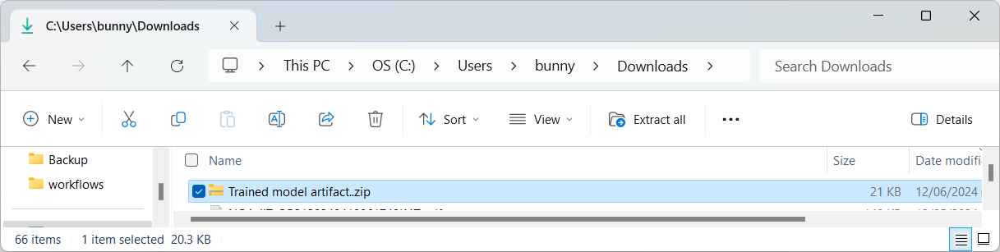<br>

        

2.  __Pull request from dev branch to main branch__

    -   Create a pull request in the GitHub Graphical User Interface (GUI) by clicking on the __New pull request__ button.

        

    -   Select __dev__ from the __Compare list__.

        

    -   The changes made in the __dev__ branch will be listed for your reference. Click the __Create pull request__ to effect the creation.

        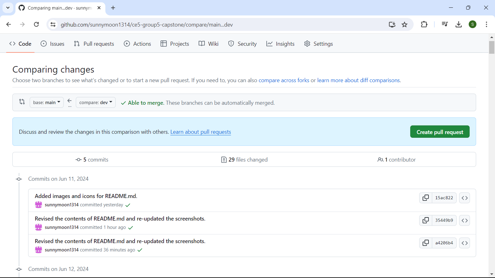

    -   Add a description for the changes made and click the __Create pull request__ button at the bottom of the screen.

        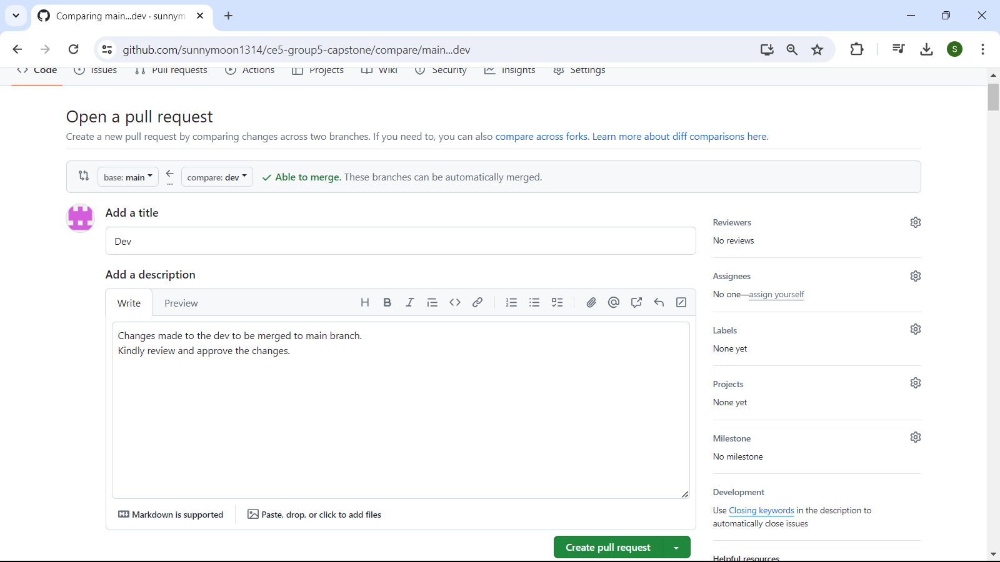

    -   The list of pending pull request(s) will be listed in the __Pull requests__ tab.

        

    -   The requestor will select the pull request to submit for approval, by clicking on the name of the branch name next to the checkbox.

    -   Within the pull request page, scroll to the bottom of the screen and add a comment, if any.
        And then click the __Merge pull request__ button.

        

    -   And then click the __Confirm merge__ button.

        

    -   If there are no conflicts to be resolved, the merger should be successful.

        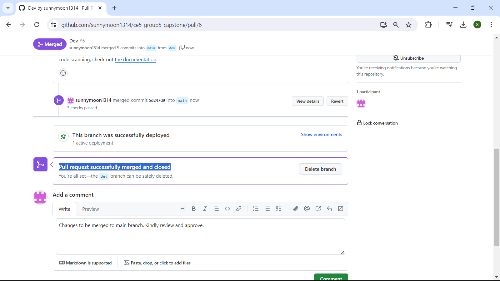

    -   The manager or the seniors will receive a notification of the pull request via email.

        

    -   Within the notification email, click the __Review pending deployments__ link.

        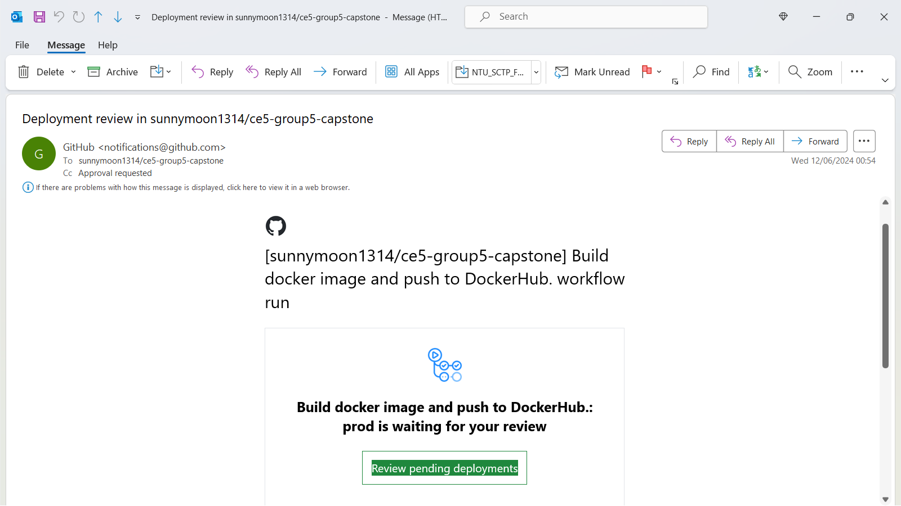

    -   In the approval screen, notice the __build-and-push-image-to-docker-hub__ job is waiting for review. If necessary, the artifacts are also available at the bottom of the screen for validation.

        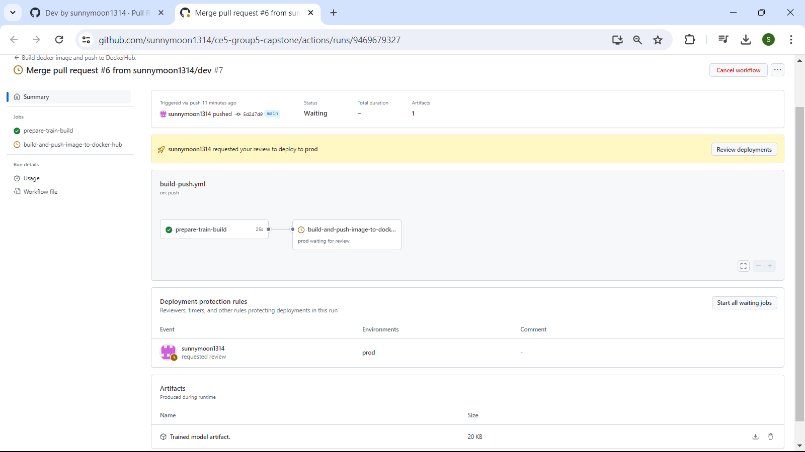

    -   Once the artifacts are checked and all in order, Click __Review deployments__ and on the next screen, tick the prod checkbox and then click the __Approve and deploy__ button.

    -   The __ml-model:latest__ image is now pushed to the DockerHub upon approval.

        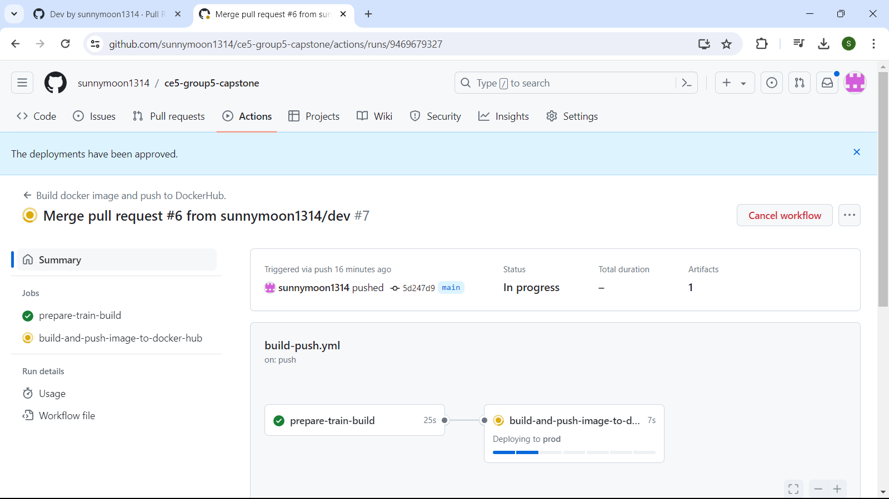<br>

        

    -   Open the Docker Desktop and check that the __ml-model:latest__ is now pushed to the DockerHub.

        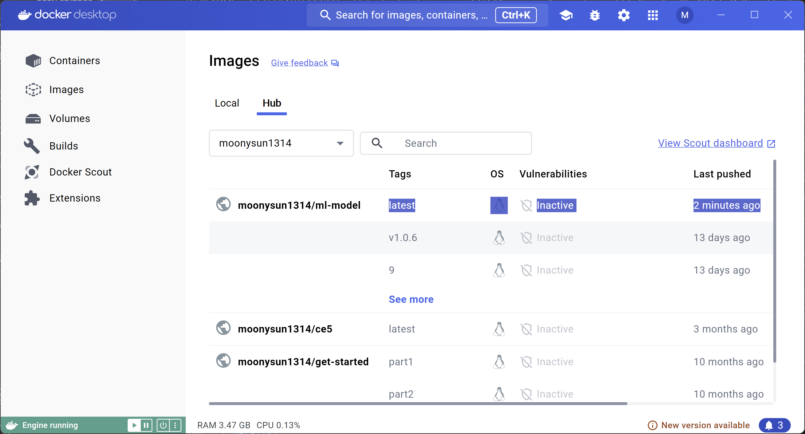

3.  __Release event on the main branch with vx.x.x semantic version tag__

    -   To create a new tag, use the `git tag` command and specify the tag name that you want to create.
        ```
        git tag <tag_name>
        ```
        For example, if you want to create a new tag v1.0.0 as the new release version, then type:
        ```
        git tag v1.0.0
        ```
    -   Use the `git tag` command again without specifying the <tag_name> to list the existing tags available in the repository.
        ```
        git tag

        v1.0.0
        ```
        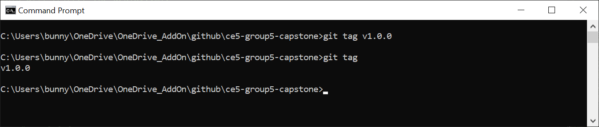

    -   Use the `git push origin` command to update the tag in the remote repository.

        

    -   Go to the GitHub GUI __Code__ tab and click on the __Tags__ icon.

        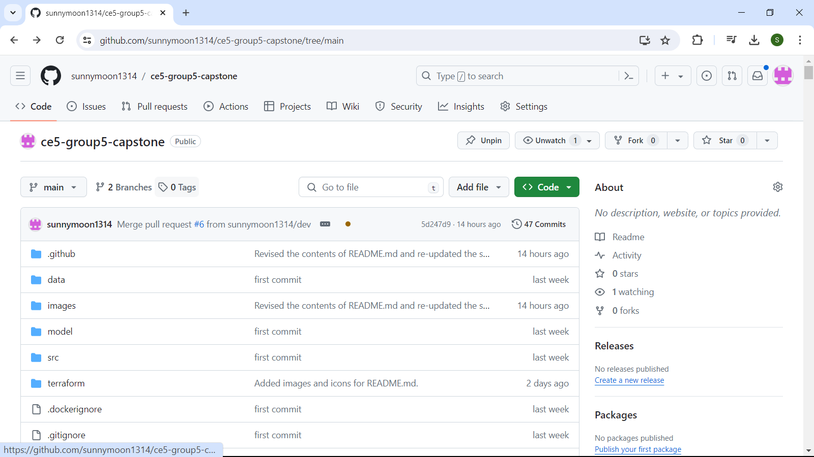<br>

        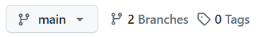

    -   You will see the list of tags available in the repository.

        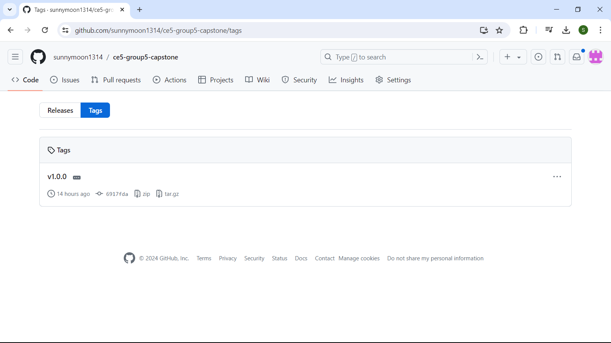

    -   Click the __vx.x.x__ (in this case v1.0.0) you want to use as the release version.

        

    -   Click __Create release from tag__ located on the top-right of the screen.

        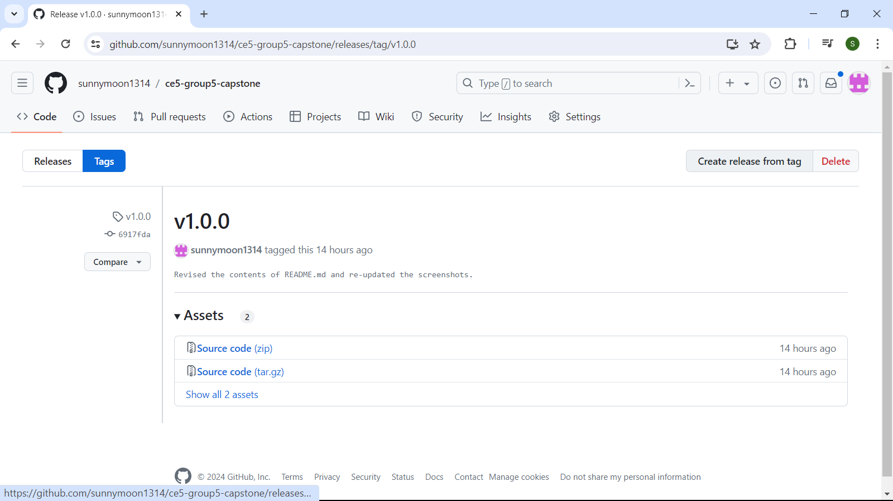

    -   Scroll to the bottom of the screen and click the __Publish release__ button.

        

    -   After the __Publish release__ button is pressed, review and approve the deployment to production.

        

    -   The __deploy.yml__ will run and update the DockerHub with new images (the existing latest tag as well as the v1.0.0).

        

    -   __deploy.yml__ in action...

        

    -   Open the Docker Desktop and check that the __ml-model:latest__ and __ml-model:v1.0.0__ are now pushed to the DockerHub.

        

Reference(s):
-   [How to Create a Tag in a GitHub Repository: A Step-by-Step Guide](https://git.wtf/how-to-create-a-tag-in-a-github-repository-a-comprehensive-guide/).
-   [How To Create Git Tags](https://devconnected.com/how-to-create-git-tags/).
</details>

### D2. Containerisation  And Microservices 

We will containerise the model file created in the preceding step to a Docker image.

Containerisation is one of the cloud-native technologies that we should always exploit, so that our application (i.e. our ML model) is portable, deployable and easily designed for scalability.

In addition to containerising our ML Model, we have also implemented industrial standard protocol using the REST API so that our image can be easily accessed via the HTTP GET and POST method using our internet browser.

<details><summary><code style="color: lightgreen">Containerisation And Microservices Testing Instructions</code></summary>

1.  Pre-requisites For Containerisation And Microservices Testing Instructions:
    - |S/N|Required software|Version|
      |---|-----------------|-------|
      | 1 | Postman sign-in account||
      |||

2.  Use Postman to test the GET method.

    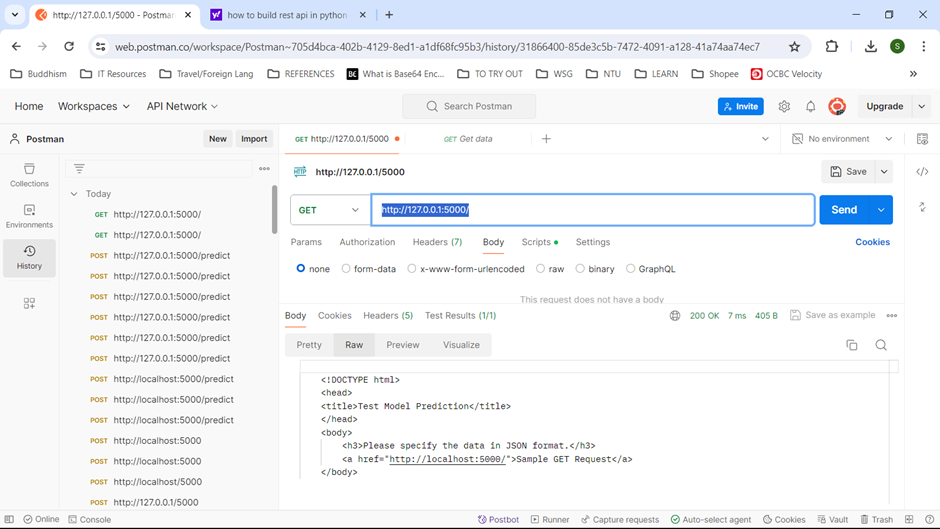

3.  Use Postman to test the POST method.

    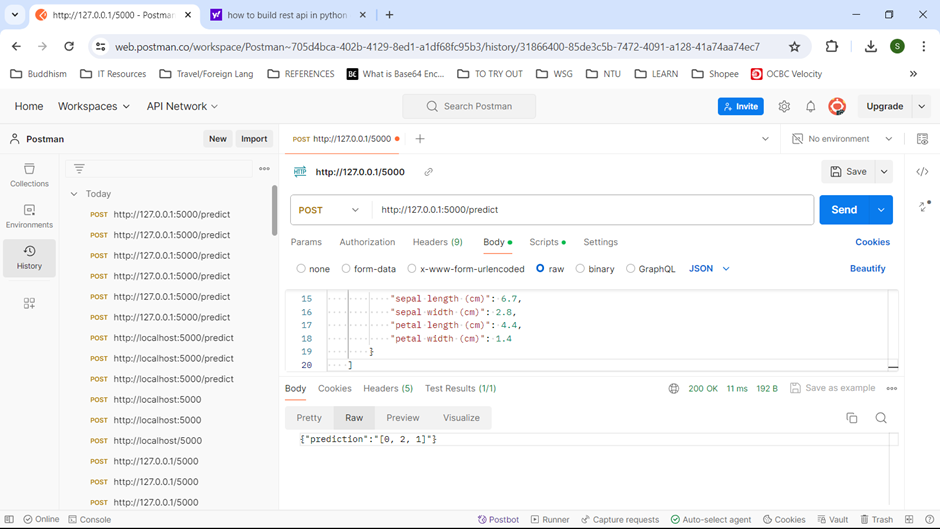
</details>

### D3. Kubernetes 

I have chosen to use the managed Kubernetes services of the 3 major cloud providers as the deployment platform.

-   Elastic Kubernetes Service (EKS) of Amazon Web Services (AWS)
-   Azure Kubernetes Service (AKS) of Microsoft Azure
-   Google Kubernetes Engine (GKE) of Google Cloud Platform

These managed Kubernetes services offer high-availability, scalability and resiliency for our deployed applications.

The Kubernetes clusters are provisioned using Terraform, which is an open-source technology to allow us to deploy infrastructure using codes.

Please refer to the respective deployment guide for the step-by-step instructions to provision the clusters.

<details><summary><code style="color: lightgreen">Elastic Kubernetes Service (EKS) Deployment Instructions</code></summary>

1.  Pre-requisites For EKS Deployment Instructions:
    - |S/N|Required software|Version|
      |---|-----------------|-------|
      | 1 | terraform       |v1.8.5 or later.|
      | 2 | kubectl         |v1.30.2 or later.|
      | 3 | AWS account with permission to provision resources.||
      | 4 | AWS credentials setup in local machine.||
      |||

2.  Navigate to the folder terraform/aws:

    

3.  Run the `terraform init` command to initialise and download any plugins.

    

4.  Run the `terraform apply` command with the argument `-var-file=prod.tfvars` and press the `Enter` key.
    ```
    terraform apply -var-file=prod.tfvars
    ```
    

    Note that the command will only provision the infrastructures (Virtual Private Cloud, Network, Firewalls, Internet Gateway, EC2, etc) for the production environment. The command __WILL NOT__ provision any pods, etc, which represent the actual workloads that run your applications.

    Please use the dev.tfvars to setup the development/testing environment, if required, in a separate run.
    ```
    terraform apply -var-file=dev.tfvars
    ```

5.  Upon prompted by the system, type `yes` and then press the `Enter` key:

    

6.  Please wait for up to 20 minutes for the Terraform to provision the EKS cluster in AWS.

    

7.  Upon completion of the EKS cluster, you should be able to see the information about the cluster:

    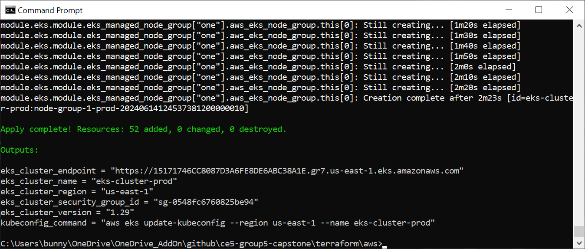<br>

    

8.  Please note down the details shown in the preceding step because the information is required in section D4 for installing the ArgoCD.

9.  After the cluster is created successfully, you need to configure your local machine to access to it.
    For EKS, the command is:
    ```
    aws eks update-kubeconfig --region <REGION-CODE> --name <CLUSTER_NAME>
    ```
    For prod environment:
    ```
    Outputs:

    eks_cluster_endpoint = "https://0B7D242CD8556B4E1F622308C953BCE8.gr7.us-east-1.eks.amazonaws.com"
    eks_cluster_name = "eks-cluster-prod" <<<<<< Need this for next step.
    eks_cluster_region = "us-east-1" <<<<<< Need this for next step.
    eks_cluster_security_group_id = "sg-0d91e4c82b2a10693"
    eks_cluster_version = "1.29"
    kubeconfig_command = "aws eks update-kubeconfig --region us-east-1 --name eks-cluster-prod"
    ```
    For dev environment:
    ```
    Outputs:

    eks_cluster_endpoint = "https://0B7D242CD8556B4E1F622308C953BCE8.gr7.us-east-1.eks.amazonaws.com"
    eks_cluster_name = "eks-cluster-dev" <<<<<< Need this for next step.
    eks_cluster_region = "us-east-1" <<<<<< Need this for next step.
    eks_cluster_security_group_id = "sg-0d91e4c82b2a10693"
    eks_cluster_version = "1.29"
    kubeconfig_command = "aws eks update-kubeconfig --region us-east-1 --name eks-cluster-dev"
    ```

10. Run the following command to update the kubectl configuration file (Located at ~/.kube/config), so that your local machine is configured to access the newly created EKS cluster.

    For prod environment:
    ```
    aws eks update-kubeconfig --region us-east-1 --name eks-cluster-prod
    ```
    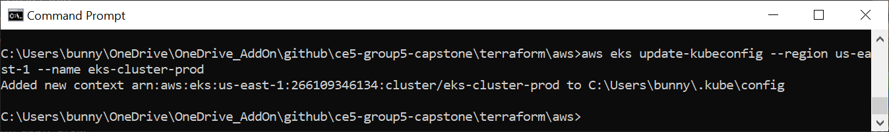<br>

    For dev environment:
    ```
    aws eks update-kubeconfig --region us-east-1 --name eks-cluster-dev
    ```
    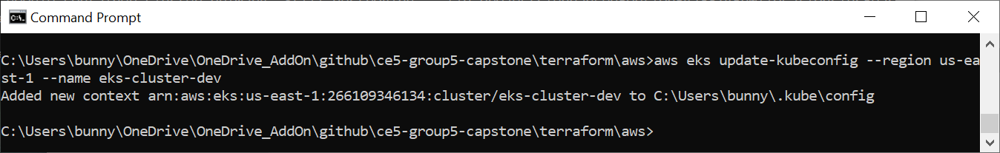

11. Run some commands using kubectl to verify you are able to access the cluster.
    ```
    kubectl get namespaces
    kubectl get pods --all-namespaces
    kubectl cluster-info
    ```
    <br>

    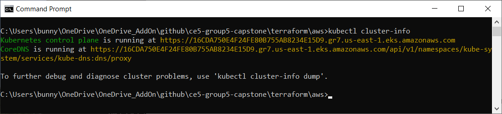

12. Before we proceed to deploy the resources to the cluster, let us rename the name of the context to a shorter name.
    ```
    kubectl get-contexts
    ```
    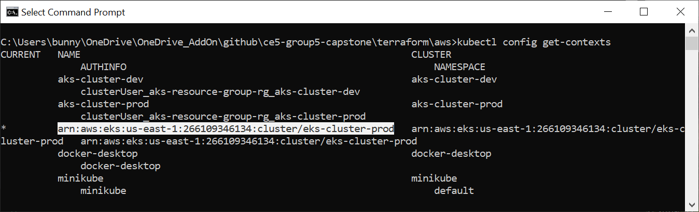<br>

    ```
    kubectl rename-context arn:aws:eks:us-east-1:266109346134:cluster/eks-cluster-prod eks-cluster-prod
    ```
    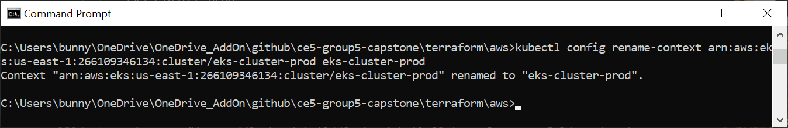<br>

    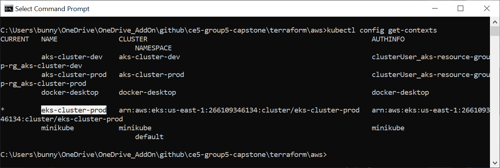

13. Navigate to the folder __pred-main/overlays/prod__ and run the below command:
    ```
    kustomize build . | kubectl apply -f -
    ```
    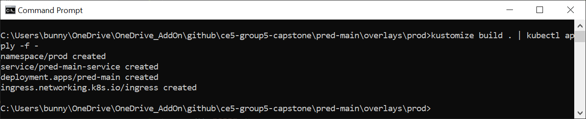

14. Please wait for few minutes till all the pods are in the Running status. Use the below command to check the status of the pods.
    ```
    kubectl get pods -A
    ```
    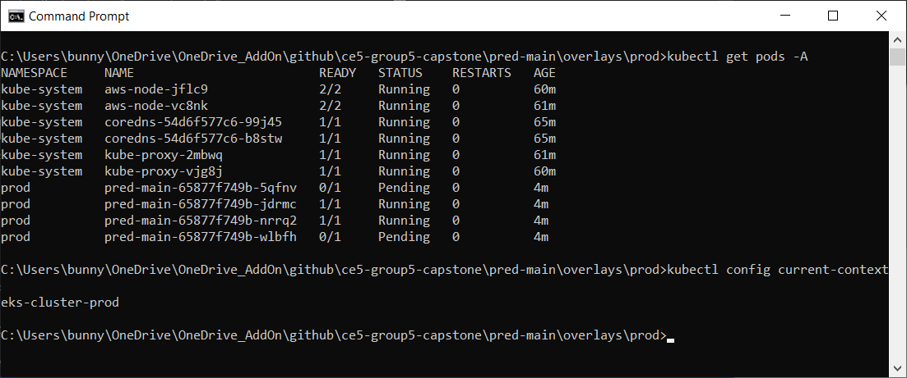

15. You are ready to proceed to setup the ArgoCD described in section D4.

16. Please remember to delete the resources that you deployed in the preceding steps if the resources are no longer required:
    ```
    terraform destroy -var-file=prod.tfvars
    ```
    <br>

    

Reference(s):
-   [Provision an EKS cluster (AWS)](https://developer.hashicorp.com/terraform/tutorials/kubernetes/eks).
</details>

<details><summary><code style="color: lightgreen">Azure Kubernetes Service (AKS) Deployment Instructions</code></summary>

1.  Pre-requisites For AKS Deployment Instructions:
    - |S/N|Required software|Version|
      |---|-----------------|-------|
      | 1 | terraform       |v1.8.5 or later.|
      | 2 | kubectl         |v1.30.2 or later.|
      | 3 | Azure account with permission to provision resources.||
      | 4 | Azure credentials setup in local machine.||
      |||

2.  Navigate to the folder terraform/aze:

    

3.  Run the `terraform init` command to initialise and download any plugins.

    

4.  Run the `terraform apply` command with the argument `-var-file=prod.tfvars` and press the `Enter` key.
    ```
    terraform apply -var-file=prod.tfvars
    ```
    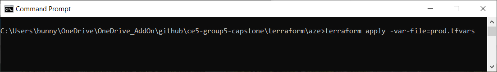

    Note that the command will only provision the infrastructures (Virtual Network, NAT Gateways, Network Security Group, Internet Gateway, AzureVM, etc) for the production environment. The command __WILL NOT__ provision any pods, etc, which represent the actual workloads that run your applications.

    Please use the dev.tfvars to setup the development/testing environment, if required, in a separate run.
    ```
    terraform apply -var-file=dev.tfvars
    ```

5.  Upon prompted by the system, type `yes` and then press the `Enter` key:

    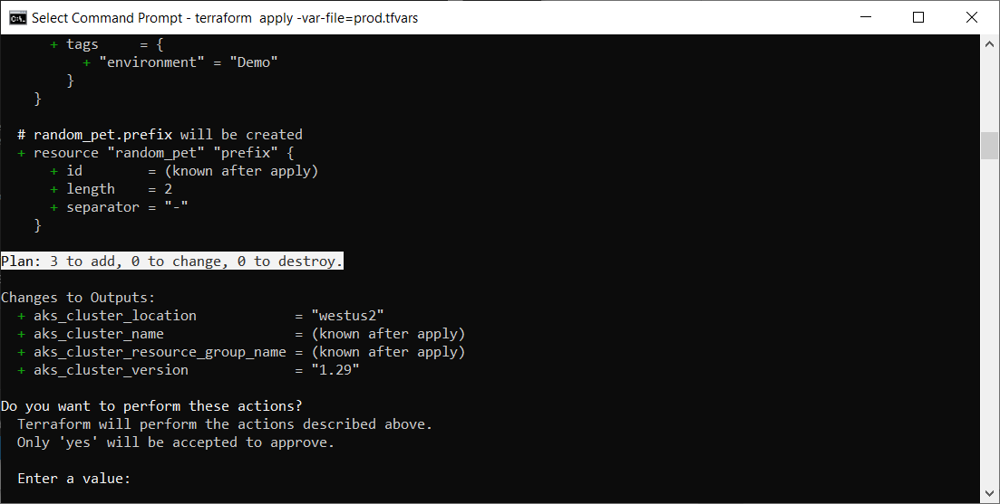

6.  Please wait for up to 10 minutes for the Terraform to provision the AKS cluster in Azure.

    

7.  Upon completion of the AKS cluster, you should be able to see the information about the cluster:

    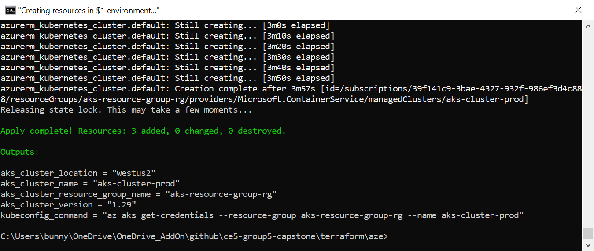<br>

    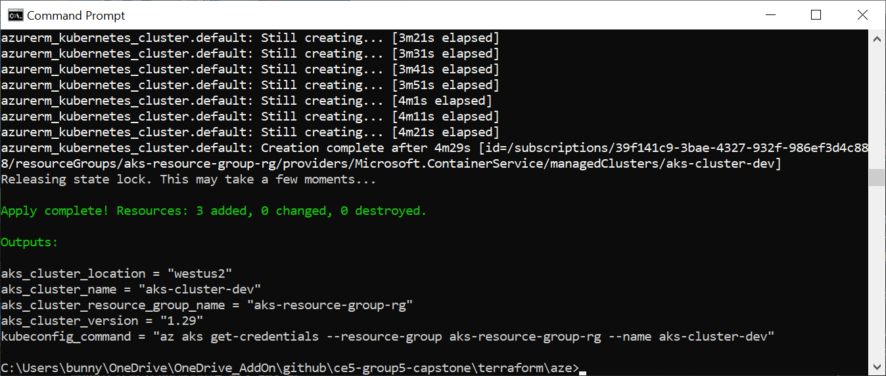

8.  Please note down the details shown in the preceding step because the information is required in section D4 for installing the ArgoCD.

9.  After the cluster is created successfully, you need to configure your local machine to access to it.
    For AKS, the command is:
    ```
    az aks get-credentials --resource-group <RESOURCE-GROUP> --name <CLUSTER_NAME>
    ```
    For prod environment:
    ```
    Outputs:

    aks_cluster_location = "westus2"
    aks_cluster_name = "aks-cluster-prod" <<<<<< Need this for next step.
    aks_cluster_resource_group_name = "aks-resource-group-rg" <<<<<< Need this for next step.
    aks_cluster_version = "1.29"
    kubeconfig_command = "az aks get-credentials --resource-group aks-resource-group-rg --name aks-cluster-prod"
    ```
    For dev environment:
    ```
    Outputs:

    aks_cluster_location = "westus2"
    aks_cluster_name = "aks-cluster-dev" <<<<<< Need this for next step.
    aks_cluster_resource_group_name = "aks-resource-group-rg" a<<<<<< Need this for next step.
    aks_cluster_version = "1.29"
    kubeconfig_command = "az aks get-credentials --resource-group aks-resource-group-rg --name aks-cluster-dev"
    ```

10. Run the following command to update the kubectl configuration file (Located at ~/.kube/config), so that your local machine is configured to access the newly created AKS cluster.

    For prod environment:
    ```
    az aks get-credentials --resource-group aks-resource-group-rg --name aks-cluster-prod
    ```
    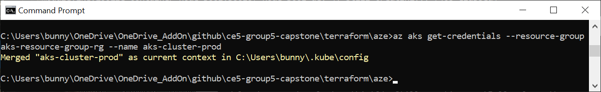<br>

    For dev environment:
    ```
    az aks get-credentials --resource-group aks-resource-group-rg --name aks-cluster-dev
    ```
    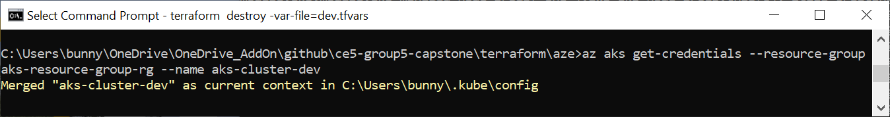

11. Run some commands using kubectl to verify you are able to access the cluster.
    ```
    kubectl get namespaces
    kubectl get pods --all-namespaces
    kubectl cluster-info
    ```
    <br>

    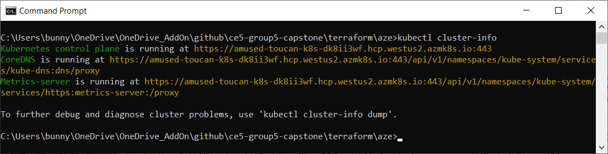

12. Navigate to the folder __pred-main/overlays/prod__ and run the below command:
    ```
    kustomize build . | kubectl apply -f -
    ```
    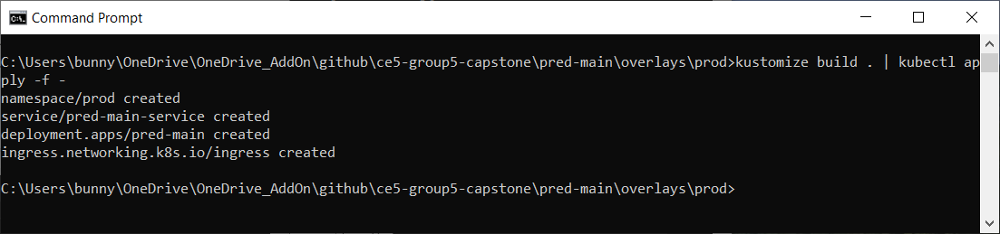

13. Please wait for few minutes till all the pods are in the Running status. Use the below command to check the status of the pods.
    ```
    kubectl get pods -A
    ```
    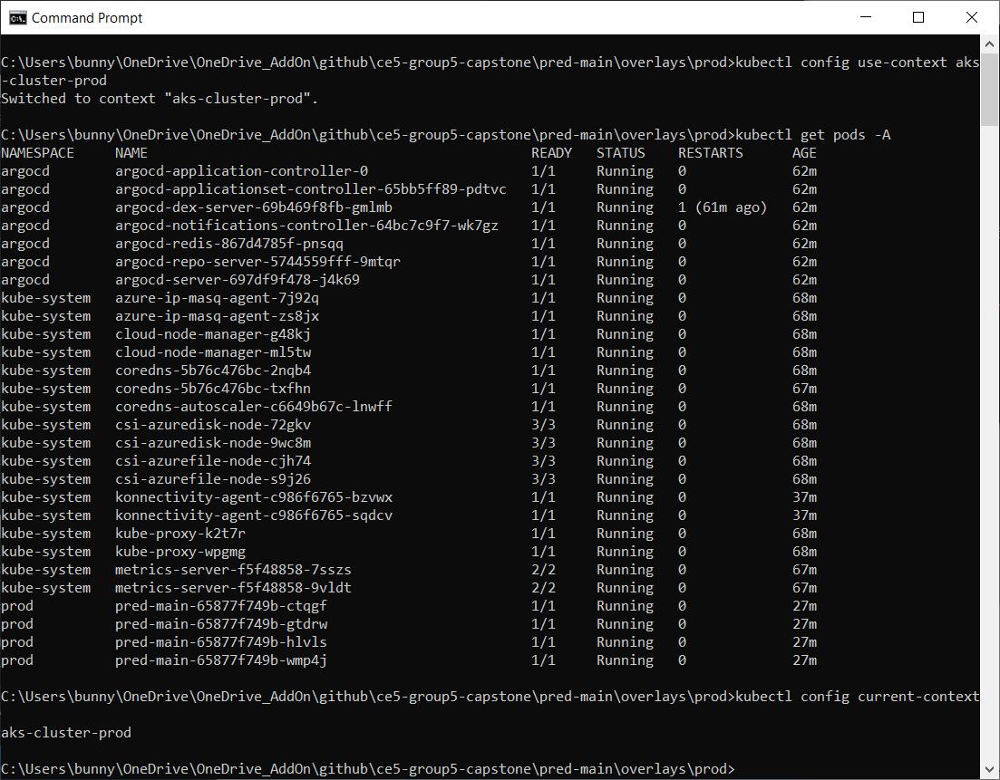

14. You are ready to proceed to setup the ArgoCD described in section D4.

15. Please remember to delete the resources that you deployed in the preceding steps if the resources are no longer required:
    ```
    terraform destroy -var-file=prod.tfvars
    ```
    <br>

    

Reference(s):
-   [Provision an AKS cluster (Azure)](https://developer.hashicorp.com/terraform/tutorials/kubernetes/aks).
</details>

<details><summary><code style="color: lightgreen">Google Kubernetes Engine (GKE) Deployment Instructions</code></summary>

1.  Pre-requisites For GKE Deployment Instructions:
    - |S/N|Required software|Version|
      |---|-----------------|-------|
      | 1 | terraform       |v1.8.5 or later.|
      | 2 | kubectl         |v1.30.2 or later.|
      | 3 | Google cloud account with permission to provision resources.||
      | 4 | Google cloud credentials setup in local machine.||
      |||

2.  Navigate to the folder terraform/gcp:

    

3.  Run the `terraform init` command to initialise and download any plugins.

    

4.  Run the `terraform apply` command with the argument `-var-file=prod.tfvars` and press the `Enter` key.
    ```
    terraform apply -var-file=prod.tfvars
    ```
    

    Note that the command will only provision the infrastructures (Virtual Private Cloud, Cloud NAT, Compute Engine Firewall Rules, Internet Gateway, Compute Engines, etc) for the production environment. The command __WILL NOT__ provision any pods, etc, which represent the actual workloads that run your applications.

    Please use the dev.tfvars to setup the development/testing environment, if required, in a separate run.
    ```
    terraform apply -var-file=dev.tfvars
    ```

5.  Upon prompted by the system, type `yes` and then press the `Enter` key:

    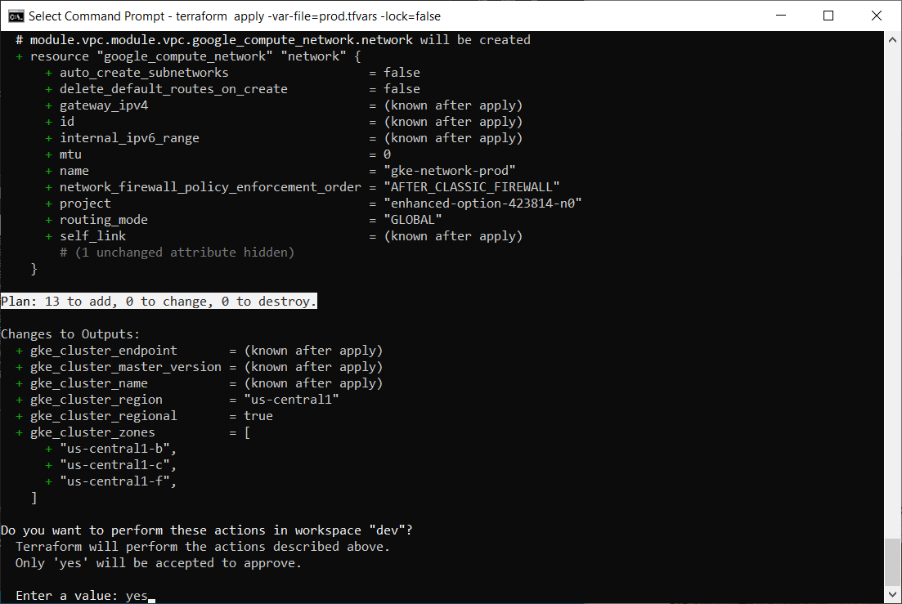

6.  Please wait for up to 20 minutes for the Terraform to provision the GKE cluster in AWS.

    

7.  Upon completion of the GKE cluster, you should be able to see the information about the cluster:

    <br>

    

8.  Please note down the details shown in the preceding step because the information is required in section D4 for installing the ArgoCD.

9.  After the cluster is created successfully, you need to configure your local machine to access to it.
    For GKE, the command is:
    ```
    gcloud container clusters get-credentials <CLUSTER_NAME> --region <REGION-CODE> --project <PROJECT_ID>
    ```
    ```
    Outputs:

    gke_cluster_endpoint = "34.41.145.139"
    gke_cluster_master_version = "1.29.5-gke.1091000"
    gke_cluster_name = "gke-cluster-prod" <<<<<< Need this for next step.
    gke_cluster_region = "us-central1" <<<<<< Need this for next step.
    gke_cluster_regional = true
    gke_cluster_zones = tolist([
        "us-central1-b",
        "us-central1-c",
        "us-central1-f",
    ])
    kubeconfig_command = "gcloud container clusters get-credentials gke-cluster-prod --region us-central1 --project enhanced-option-423814-n0"
    ```
    ```
    Outputs:

    gke_cluster_endpoint = "34.138.134.79"
    gke_cluster_master_version = "1.29.5-gke.1091000"
    gke_cluster_name = "gke-cluster-dev" <<<<<< Need this for next step.
    gke_cluster_region = "us-east1" <<<<<< Need this for next step.
    gke_cluster_regional = false
    gke_cluster_zones = tolist([])
    kubeconfig_command = "gcloud container clusters get-credentials gke-cluster-dev --region us-east1-b --project enhanced-option-423814-n0"
    ```

10. Run the following command to update the kubectl configuration file (Located at ~/.kube/config), so that your local machine is configured to access the newly created GKE cluster.
    ```
    gcloud container clusters get-credentials gke-cluster-prod --region us-central1 --project enhanced-option-423814-n0
    ```
    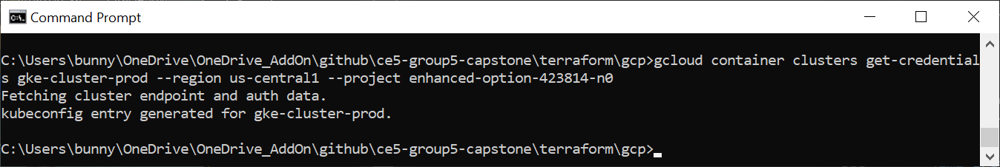<br>

    ```
    gcloud container clusters get-credentials gke-cluster-dev --region us-east1-b --project enhanced-option-423814-n0
    ```
    

11. Run some commands using kubectl to verify you are able to access the cluster.
    ```
    kubectl get namespaces
    kubectl get pods --all-namespaces
    kubectl cluster-info
    ```
    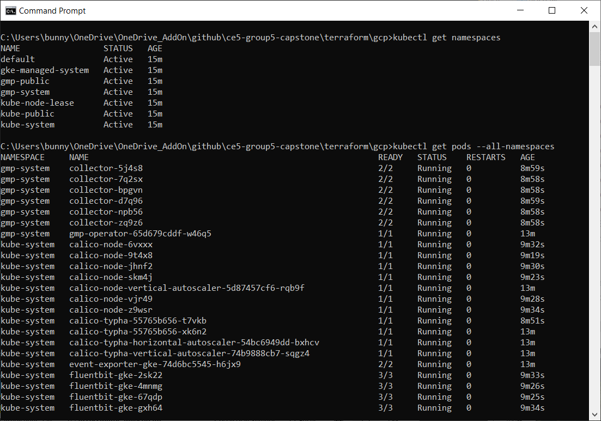<br>

    

12. Navigate to the folder __pred-main/overlays/prod__ and run the below command:
    ```
    kustomize build . | kubectl apply -f -
    ```
    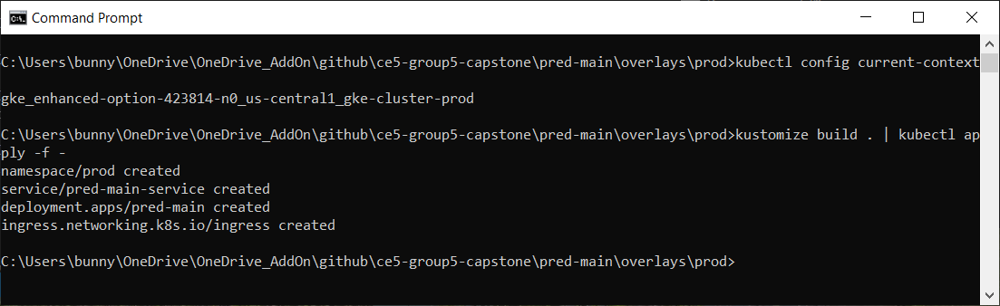

13. Please wait for few minutes till all the pods are in the Running status. Use the below command to check the status of the pods.
    ```
    kubectl get pods -A
    ```
    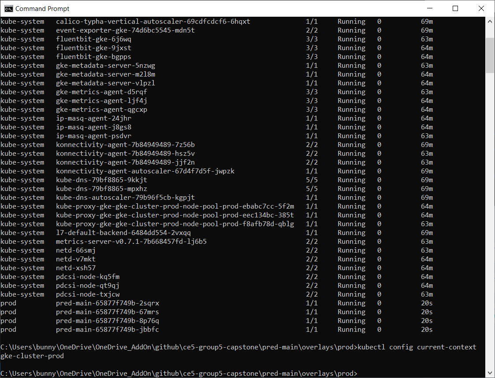

14. You are ready to proceed to setup the ArgoCD described in section D4.

15. Please remember to delete the resources that you deployed in the preceding steps if the resources are no longer required:
    ```
    terraform destroy -var-file=prod.tfvars
    ```
    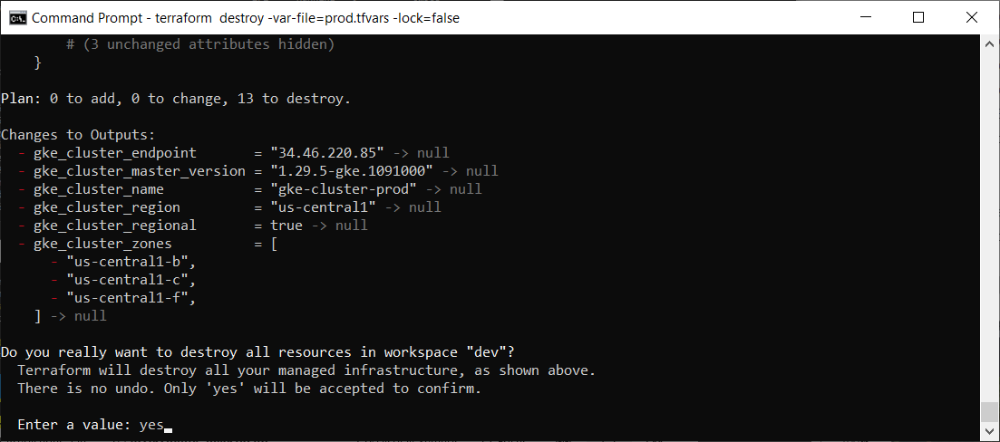<br>

    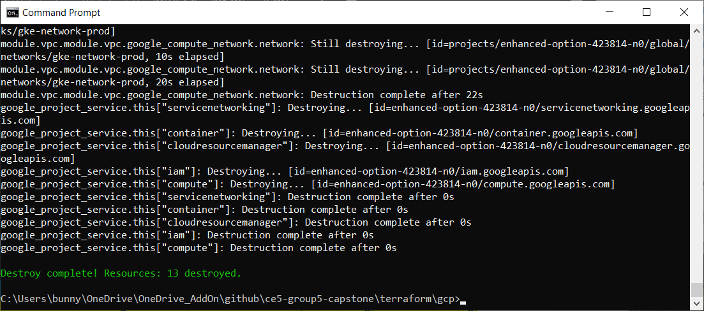

Reference(s):
-   [Provision a GKE cluster (Google Cloud)](https://developer.hashicorp.com/terraform/tutorials/kubernetes/gke).
</details>

### D4. ArgoCD 

After deployment of our ML model as an application in the Kubernetes cluster, we make use of ArgoCD to automate the continuous deployment pipeline.

ArgoCD is a declarative GitOps-based continuous deployment tool for Kubernetes. It helps us to deploy and manage applications on Kubernetes clusters in an automated, reliable and repeatable way. It does this by continuously monitoring the live state of the applications in a cluster and compares the state against the desired state defined in the GitHub repository.

Whenever a developer pushes changes to the GitHub repository, ArgoCD will detect the changes and synchronise them to the Kubernetes.

To enable GitOps to work, it is a best practice to have 2 repositories. One for the application source codes and another one for the configuration codes. The configuration codes define the assets in the Kubernetes cluster such as Deployments, Services, ConfigMap, etc. Whenever the configuration codes are updated, ArgoCD will kick in and synchronise the live versus desired states so that they are the same eventually.

However, ArgoCD is only a continuous deployment (CD) tool and we still require a pipeline for continuous integration (CI) that will test and build our application.

#### _Figure D4. CD automation using ArgoCD._
<br>

When a developer updates the application source codes, he will test and then build an image which will be pushed to a container repository. The CI pipeline will the trigger updates to the configuration repository (e.g. update the image version) which will cause ArgoCD to synchronise.

GitOps using ArgoCD has these benefits:
- It has the ability to enable Disaster Recovery. In DevOps world, we do not back things up anymore but recreate them instead. If we lose a Kubernetes cluster, we can just bootstrap a new cluster and point the new ArgoCD deployments to the configuration repository. Since everything is defined in codes, ArgoCD will bring up the new cluster to the desired state and we are back in business.
- It has the ability to orchestrate deployments to multiple Kubernetes clusters. ArgoCD is not bound to a single Kubernetes cluster. We can have ArgoCD installed on one cluster controlling the configurations of the other clusters. If any of these clusters were to fail, ArgoCD should be able to bring them back. In addition, if we were to lose the cluster where ArgoCD is installed, it would also be recoverable as the configuration of ArgoCD can be stored as YAML file.
- The applications deployed in the Kubernetes clusters are always synchronised with the single source of truth (i.e. the source GitHub repositories).
- We can adopt security best practice to grant access only to those who are responsible for supporting the CD pipeline.
- We can implement blue/green deployment and/or canary deployment with ease.
- We can always rollback to the previous working version should the new version is not stable.

<details><summary><code style="color: lightgreen">ArgoCD Installation (Using Manifest) Instructions</code></summary>

1.  Pre-requisites For ArgoCD Installation (Using Manifest) Instructions:
    - |S/N|Required software|Version|
      |---|-----------------|-------|
      | 1 | kubectl         |v1.30.2 or later.|
      | 2 | kustomize       |v5.3.0 or later.|
      | 3 | A Kubernetes cluster installed and configured in ~.kube/config.||
      |||

    The ~.kube/config file is usually found in C:/Users/YourID/.kube/config on Windows and /home/YourID/.kube/config on Linux.

    There is one application configuration respository we need to specify when setting up ArgoCD.

    This is the folder we specify under the __SOURCE__ section where you type your GitHub repo, i.e. https://github.com/sunnymoon1314/ce5-group5-capstone and then the specific path that contains the Helm charts or Kustomise yaml files.

    In this case, I am using Kustomise, so the path is at pred-main/overlays/prod.

    For the application source code respository that contains your program source codes (i.e. Java, Python or Node.js codes), ArgoCD will not be responsible for tracking the changes and hence there is no need to configure ArgoCD to monitor these code changes.

2.  Run the following command to create the argocd namespace. Ensure that you are using the context __aks-cluster-prod__ for AKS cluster.
    ```
    kubectl config use-context aks-cluster-prod

    kubectl create namespace argocd
    ```

    

3.  Apply the __install.yaml__ manifest file to install ArgoCD.
    ```
    kubectl apply -n argocd -f https://raw.githubusercontent.com/argoproj/argo-cd/stable/manifests/install.yaml
    ```
    <br>

    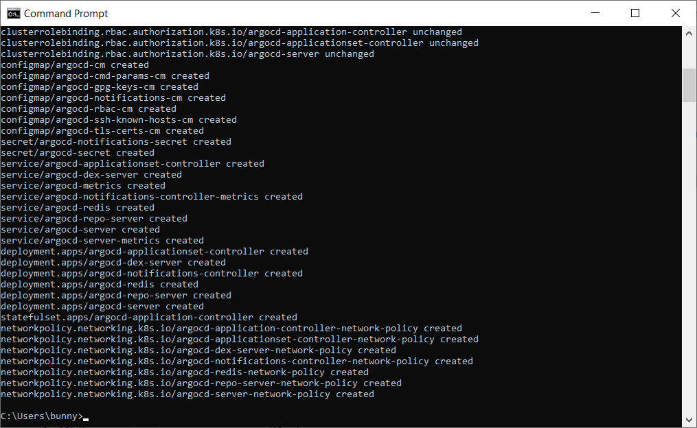

4.  Use this command to verify the ArgoCD installation.
    ```
    kubectl get all --namespace argocd
    ```
    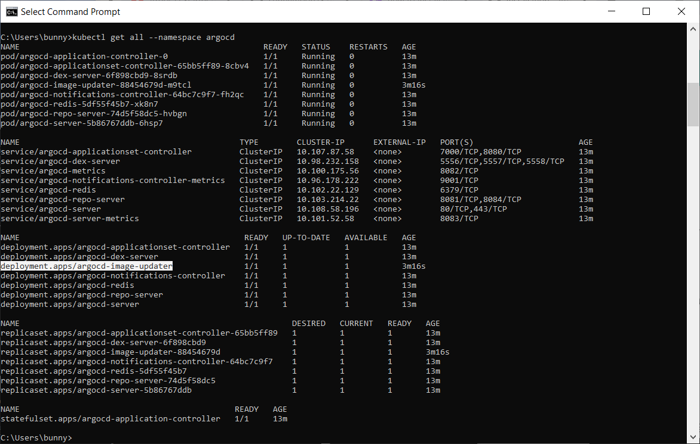

    Quite a lot of components are required for ArgoCD to function properly.

5. We can access ArgoCD via its Graphical User Interface (GUI). But we need to use a mechanism called “port-forwarding” on the service called service/argocd-server (which is listening on port 80 and 443). By-pass the certificate check, if necessary.
    ```
    kubectl get services -n argocd

    kubectl port-forward service/argocd-server --namespace argocd 8080:443
    ```
    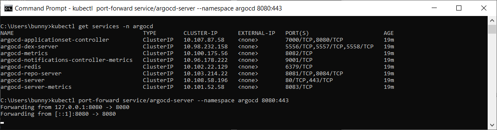

6. Run the following command to get the initial password of ArgoCD.
    ```
    kubectl -n argocd get secret argocd-initial-admin-secret -o jsonpath="{.data.password}"
    ```
    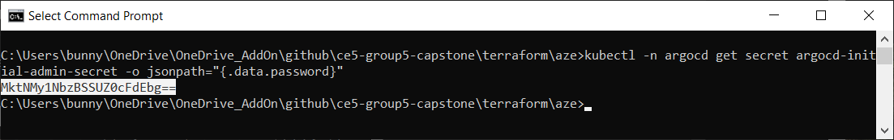

    ```
    MktNMy1NbzBSSUZ0cFdEbg==
    ```

    The above password is base64 encoded. To get the actual password that we can use to login to the ArgoCD GUI, we have to decode this password using `base64 -d` command.

    However, since I am using Windows and it does not have the base64 command (which is a Linux command), I need to open a WSL terminal to decode it.

    ```
    echo MktNMy1NbzBSSUZ0cFdEbg== | base64 -d ; echo
    2KM3-Mo0RIFtpWDn <<<<<< This is the ArgoCD initial secret in base64.
    ```
    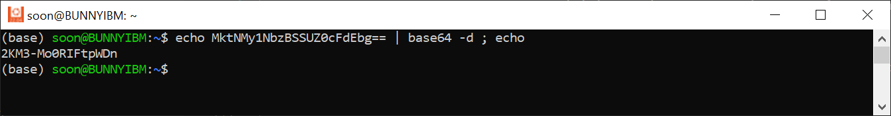

7.  Go to the browser and enter the following address as the URL to access the ArgoCD GUI.
    ```
    http://localhost:8080
    ```
    If prompted that the connection is not private, click the __Advanced__ button and then click the link __Proceed to localhost (unsafe)__.

    

8.  When the ArgoCD GUI is up, enter __admin__ as the __Username__. For the __Password__, enter __N-i-HIhc76E8qJNS__ (Password you obtained in step 7). And then click the __SIGN IN__ button.

    

9. This is the ArgoCD landing page.

    

10. Within the ArgoCD GUI, click  and enter the following details:
    -   GENERAL:
        -   Application Name: pred-main-aks-prod
        -   Project Name: default
        -   SYNC POLICY: Automatic
    -   SYNC OPTIONS
        -   __AUTO-CREATE NAMESPACE__: Tick the checkbox
    -   SOURCE
        -   Repository URL: https://github.com/sunnymoon1314/ce5-group5-capstone
        -   Path: pred-main/overlays/prod
    -   DESTINATION
        -   Cluster URL: https://kubernetes.default.svc
        -   Namespace: prod
    -   Kustomize
        -   IMAGES
            -   moonysun1314/ml-model
            -   v1.0.1

    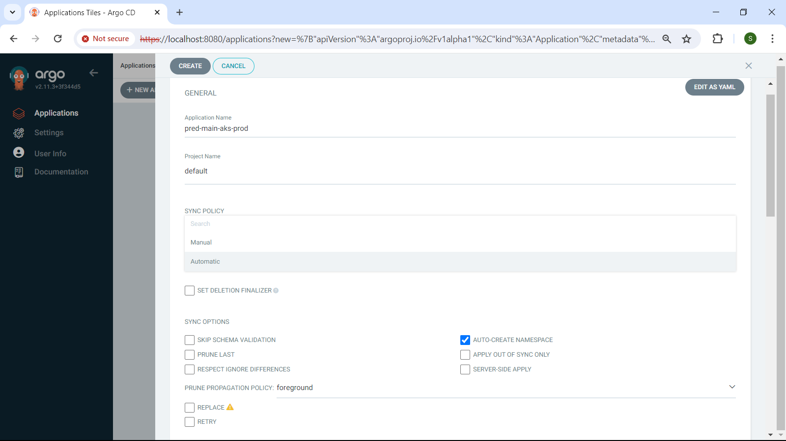<br>

    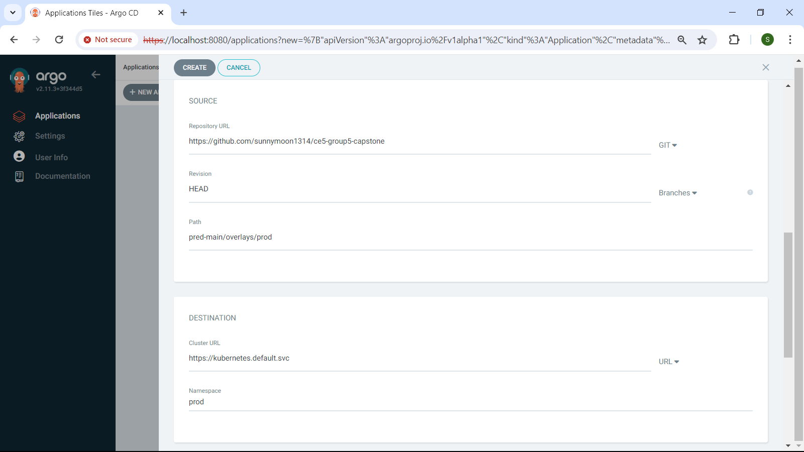<br>

    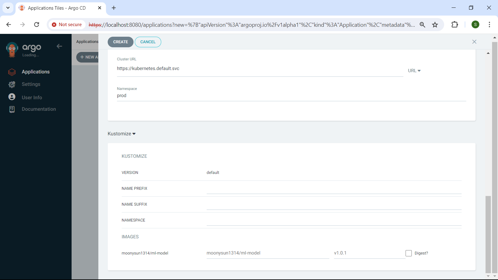

11. Then click the  button at the top-left corner of the screen.

12. Please wait for the application to show healthy status (i.e. Synced).

    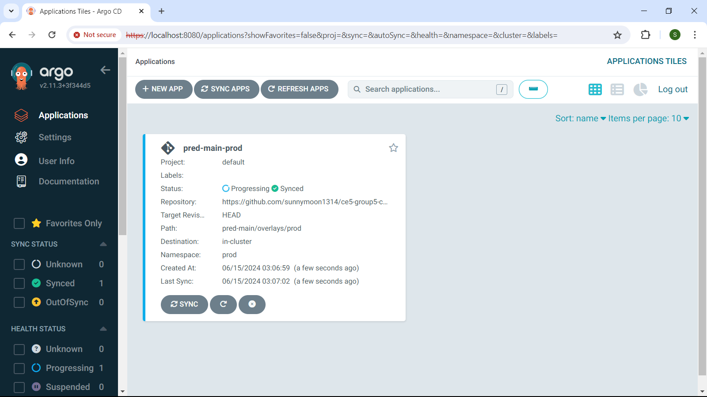<br>

    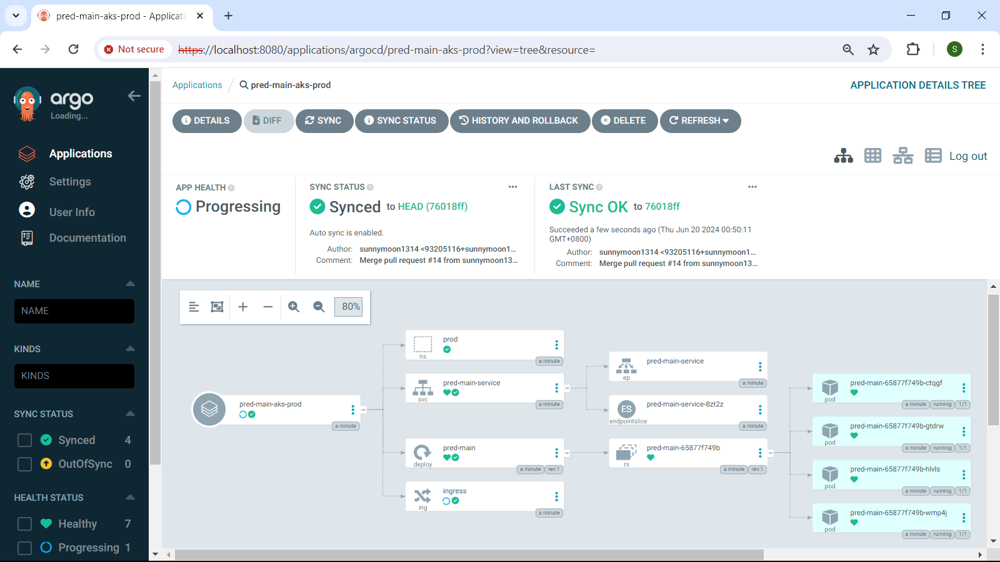

13. Use this command to access the application.
    ```
    kubectl get services -n argocd

    kubectl port-forward service/pred-main-service 5000:5000 --namespace prod
    ```
    <br>

    

14. Repeat step 10 to 12 to create more applications, if required.
</details>

<details><summary><code style="color: lightgreen">ArgoCD To Manage Multiple Kubernetes Clusters Instructions</code></summary>

1.  With the 3 Kubernetes clusters provisioned at the respective cloud providers, we are now ready to setup ArgoCD to manage Kubernetes clusters in a multi-cloud setting.

2.  Here are the details of the 3 clusters provisioned at the local machine:
    - |S/N|Kubernetes|Context         |Namespace|Remarks                                  |
      |---|----------|----------------|---------|-----------------------------------------|
      | 1 | EKS      |eks-cluster-prod| prod    |                                         |
      | 2 | AKS      |aks-cluster-prod| prod    |This the context with ArgoCD installed.  |
      | 3 | GKE      |gke-cluster-prod| prod    |                                         |
      ||||

3.  Check the context in __~.kube/config__ by executing the following command:
    ```
    kubectl config get-contexts -o name
    ```
    

    Note that for EKS or GKE, the original namespace generated by Terraform may be too long. If necessary, you can rename the context name using the `kubectl config rename-context` command.

    ```
    kubectl config rename-context arn:aws:eks:us-east-1:266109346134:cluster/eks-cluster-prod eks-cluster-prod

    kubectl config rename-context gke_enhanced-option-423814-n0_us-central1_gke-cluster-prod gke-cluster-prod
    ```
    

    Henceforth, I assumed the contexts are called eks-cluster-prod, aks-cluster-prod and gke-cluster-prod for EKS, AKS and GKE cluster respectively.

4.  The pods details of the respective contexts for reference:
    aks-cluster-prod context with 4 pods deployed. ArgoCD is also installed in this context.

    

    eks-cluster-prod context with 4 pods deployed.

    

    gke-cluster-prod context with 4 pods deployed.

    

5.  Go to the __Settings/Clusters__ tab.

    

6.  To add clusters to the ArgoCD, we have to use the ArgoCD CLI tool. Hence, we have to first login to ArgoCD CLI. When prompted whether to proceed insecurely, response with __y__ and press __Enter__.
    ```
    argocd login localhost:8080
    ```
    

7.  Use the following commands to add both the EKS and GKE clusters to ArgoCD:
    ```
    argocd cluster add eks-cluster-prod

    argocd cluster add gke-cluster-prod
    ```

    If you are prompted by the below warning, response with __y__ and press __Enter__.
    ```
    This will create a service account `argocd-manager` on the cluster referenced by context `XXX-cluster-prod` with full cluster level privileges. Do you want to continue [y/N]?
    ```

    <br>

    

8.  Go to the __ArgoCD GUI Landing Page__ and select __Settings__ from the left panel and then select the __Clusters__ tab. Verify the clusters have been added to ArgoCD:

    

9.  You can also list the clusters using the command line:
    ```
    argocd cluster list
    ```
    

    Notice ArgoCD displayed a message for the EKS and GKE cluster that:
    ```
    Cluster has no applications and is not being monitored.
    ```

10. As such, after adding EKS and GKE clusters to ArgoCD, we need to create applications (one application per cluster) within ArgoCD to tell ArgoCD which folder stores the configuration repository so that it knows the folder to monitor for changes made.

    We have already created the application for AKS cluster in step 11. Hence, no further actions required for AKS cluster.

11. Within the ArgoCD GUI, click  and enter the following details for EKS cluster:
    -   GENERAL:
        -   Application Name: pred-main-eks-prod
        -   Project Name: default
        -   SYNC POLICY: Automatic
    -   SYNC OPTIONS
        -   __AUTO-CREATE NAMESPACE__: Tick the checkbox
    -   SOURCE
        -   Repository URL: https://github.com/sunnymoon1314/ce5-group5-capstone
        -   Path: pred-main/overlays/prod
    -   DESTINATION
        -   Cluster URL: 
        https://630843B464C33E41DE0F9E1AA22B2269.gr7.us-east-1.eks.amazonaws.com
        -   Namespace: prod
    -   Kustomize
        -   IMAGES
            -   moonysun1314/ml-model
            -   v1.0.1

    <br>

    <br>

    

    Note the Cluster URL is:
    ```
    https://630843B464C33E41DE0F9E1AA22B2269.gr7.us-east-1.eks.amazonaws.com
    ```

12. Create another application and enter the following details for GKE cluster:
    -   GENERAL:
        -   Application Name: pred-main-gke-prod
        -   Project Name: default
        -   SYNC POLICY: Automatic
    -   SYNC OPTIONS
        -   __AUTO-CREATE NAMESPACE__: Tick the checkbox
    -   SOURCE
        -   Repository URL: https://github.com/sunnymoon1314/ce5-group5-capstone
        -   Path: pred-main/overlays/prod
    -   DESTINATION
        -   Cluster URL: https://34.70.23.138
        -   Namespace: prod
    -   Kustomize
        -   IMAGES
            -   moonysun1314/ml-model
            -   v1.0.1

    <br>

    <br>

    

    Note the Cluster URL is:
    ```
    https://34.70.23.138
    ```

13. Up to this point, you have already setup ArgoCD to monitor the following folder(s) for changes:
    -   pred-main/overlays/prod

    Any changes made to the yaml files within this folder (as well as the parent base folder) will be detected by ArgoCD which will automatically synchronise the 3 applications you configured to match the new states/changes.

    Currently, the 3 clusters are all synchronised to the same configuration folder at pred-main/overlays/prod. Hence, all clusters have 4 pods deployed:

    AKS cluster has 4 pods:

    

    EKS cluster has 4 pods:

    

    GKE cluster has 4 pods:

    

14. For demonstration purpose, let us change the number of replicas in the __overlays/prod/kustomization.yaml__ file from 4 to 5. Please change this while you are in the dev branch.

    <br>

    <br>

    <br>

    

15. Git commit the changes made in step 14 and then create a pull request in GitHub GUI to merge with the main branch.

    Git add/commit/push:

    

    Create pull request 1/2:

    

    Create pull request 2/2:

    

    Merge pull request:

    

    Confirm merge:

    

    Pull request successfully merged and closed:

    

    Select workflow:

    

    Review deployments:

    

    Approve and deploy:

    

16. Observe the 3 ArgoCD applications. Please wait for up to 3 minutes for ArgoCD to detect the changes made in step 14. Alternatively, you can click the __REFRESH APPS__ button to manually refresh the applications.

    

    You can see ArgoCD is able to detect the change in the application configuration repository (i.e. pred-main/overlays/prod and also the parent folder at pred-main/base) and synchronise all the clusters to show 5 pods per cluster.

    AKS cluster has 5 pods:

    

    EKS cluster has 5 pods:

    

    GKE cluster has 5 pods:

    

Reference(s):
-   [Set up multi-environment on Argo CD – Part 1](https://blog.nashtechglobal.com/practical-management-of-gitops-deployments-across-multiple-clusters-part-1)
-   [Set up multi-environment on Argo CD – Part 2](https://blog.nashtechglobal.com/practical-management-of-gitops-deployments-across-multiple-clusters-part-2)
-   [Kustomize](https://redhat-scholars.github.io/argocd-tutorial/argocd-tutorial/03-kustomize.html)
-   [Deploy using ArgoCD and Github Actions](https://medium.com/@mssantossousa/deploy-using-argocd-and-github-actions-888f7370e480)
</details>

##  E. Summary Of Lessons Learnt And Challenges Faced

Through the hands-on experience while implementing this project, I have learnt the following concepts:
-   CI/CD pipeline using GitHub Actions.
-   Containerisation: Any software, databases, ML models, can be containerised and run as Docker containers!!!
-   Kubernetes: This is a very versatile container orchestration platform that has auto-healing capability. The story does not end here because the functionalities of Kubernetes can be enhanced and extended via the mechanism called Custom Resource Definitions.
-   Infrastructure-as-codes using Terraform. It is so effortless to provision infrastructures and Kubernetes clusters using IaC.

Some of the challenges I faced:

-   On __GitHub Actions__: This is a tool for coders!!! There are so many contributions from the community and sometimes I was lost as to which actions should be the appropriate one to use.
-   On __ArgoCD__: It was quite impossible to trial and error on certain tools (such as ArgoCD) if you do not understand some of the basic concepts such as Helm charts and Kustomize. So I had to take a few steps back to learn the basics before the actual hands-on using ArgoCD.
-   On __Terraform__: Some of the attributes were only introduced in new versions of the Terraform provider. For example, deletion_protection must be explicitly set to false in order to destroy the resources. I was panicked because I was not able to destroy the resources using `terraform destroy` and that will mean cost incurred for the running resources. Luckily I found the solution from stackoverflow.com that you can update deletion_protectio by editing the terraform state file directly!!!

Most of the other issues I encountered could be resolved by browsing through the suggestions and answers provided by gurus in the stackoverflow.com channel as well as via their blog posts.

##  F. Suggestions For Future Work

Due to time constraint, I am not able to implement few topics which were originally in the project plan (ArgoCD Image Updater and monitoring tools such as Prometheus).

There are still a lot of room for improvements and I will continue the learning journey to get more exposure and experience via hands-on and collaboration with other experts in the area of cloud technologies.

There are some areas which I would like to continue to explore in the near future:
-   To research and better understand the other options available for automating MLOps workflow. There are a lot of open-source MLOps workflow platforms that I have not explored such as:
    -   [MLFlow](https://mlflow.org/), which is yet another open-source project tailored made for building MLOps pipeline.
    -   [KubeFlow](https://www.kubeflow.org/) which allows us to leverage on Kubernetes clusters to perform distributed training of the ML models.
    -   Managed ML Services of [Sagemaker](https://aws.amazon.com/pm/sagemaker/?trk=a5d4c613-ebfe-4261-8673-3abec6168005&sc_channel=ps&ef_id=:G:s&s_kwcid=AL!4422!10!71399764321901!71400284796187) from AWS as well as those from [Azure](https://azure.microsoft.com/en-us/products/machine-learning/) and [Google Cloud](https://cloud.google.com/products/ai/?hl=en).
    -   [Data Version Control](dvc.org) open-source platform which offers lots of toolsets for building MLOps workflow.

-   To get more hands-on experience on setting up monitoring tools such as [Prometheus](https://prometheus.io/) and [Grafana](https://grafana.com/), as well as monitoring tools specifically built for monitoring ML model performance ([neptune.ai](https://neptune.ai/blog/performance-metrics-in-machine-learning-complete-guide)  and [EvidentlyAI](www.evidentlyai.com)). It is valuable skillset to know how to get insights to the various metrics, logs and traces for troubleshooting, optimising and monitoring the operational and performance capabilities of the various applications and microservices.

-   Tools for managing Kubernetes clusters and the microservices, such as [Rancher](https://www.rancher.com/), [Consul](https://www.consul.io/) and [Istio](https://istio.io/) so that we are in a better position to manage the clusters for improved observerability, streamlined traffic management and better security.

##  G. Reference Books

Here are few books which I used as references to help in the preparation of this project.

Though there are lots of YouTube channels and blog posts available in the Internet for us to refer to, yet adopting a systematic method of learning by reading books could be an effective way to start the learning journey at your own pace.

Wishing you all a pleasant and fruitful learning journey!!!

Reference Books:
-   [Introducing MLOps, Mark Treveil, O'Reilly, 2021](https://libbyapp.com/search/nlb/search/query-Introducing%20MLOps/page-1/5929319).

    

-   [Practical MLOps, Noah Gift, O'Reilly, 2021](https://libbyapp.com/search/nlb/search/query-Practical%20MLOps/page-1/6807813).

    

-   [The Kubernetes Book, Nigel Poulton, Packt Publishing, 2019](https://libbyapp.com/search/nlb/search/query-the%20kubernetes%20book/page-1/4845928).

    

-   [Managing Kubernetes, Brendan Burns, O'Reilly, 2018](https://libbyapp.com/search/nlb/search/query-managing%20kubernetes/page-1/4408766).

    

-   [GitOps Cookbook, Natale Vinto, O'Reilly, 2022](https://libbyapp.com/search/nlb/search/query-GitOps%20Cookbook/page-1/9501907).

    

-   [Practical GitOps, Rohit Salecha, APress, 2023](https://libbyapp.com/search/nlb/search/query-GitOps%20Cookbook/page-1/9501907).

    
