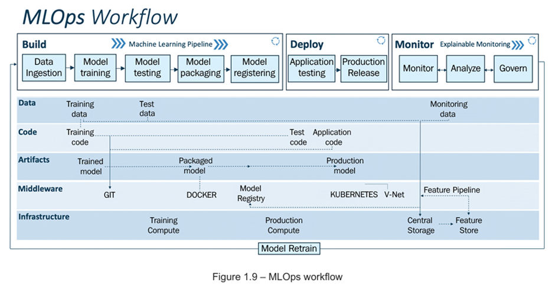

# NTU-SCTP Cloud Infrastructure Engineering
## Cohort 5 Group 5 Capstone Project<br>
Submitted By: __SOON Leah Foo__<br>
Submitted On: __15 Jun 2024__

##  A. Project Title

## Machine Learning Operations using GitHub Actions with automated deployment to instrumented Kubernetes clusters in a multi-cloud environment.

##  B. Business Use Case: TraumWare Company Profile

TraumWare Manufacturing Pte Ltd is a Small-Medium Sized company specialising in manufacturing high-precision bolts and nuts for CNC machineries.

In order to ensure the machines are operationally healthy and functioning on a daily basis, the company has to schedule for planned maintenance of the machinery on a regular basis.

The company has more than 20 different makes and models of machineries used in the fabrication process, and it has always been daunting for the company to monitor the status of the various machines. The company approached us for advice and assessment whether there are alternative solutions for a more efficient workflow in terms of optimal forecast plan and efficient usage of available human resources to do the maintenance work.

##  C. Project Proposal

Corrective and preventive maintenance is often a major part of manufacturing industries. Although this process is complex and expensive when conducted with conventional approaches, machine learning has now made it easier to discover meaningful insights and hidden patterns in factory data. Because this process helps in reducing risks associated with unexpected failures, companies can also reduce unnecessary expenses by implementing machine learning models. What’s more, artificial intelligence and machine learning algorithms work in collaboration to analyze historical data and ensure workflow visualization.

Here is our proposed solution:

1. We will implement a AI-powered solution to solve the problem. We will automate the machine learning model process so that the resultant trained model can be deployed to the production operating environment without much human intervention.
2.	We will leverage on open-source software and cloud technologies to ensure our solution is scalable and highly available. The trained ML models will be containerised and deployed as RESTAPI endpoints in Kubernetes clusters.
3.	We will deploy the ML model to Kubernetes.
4.	We will put in place an automation process using the GitOps methodology to ensure the ML model version used in the production environment is automatically updated whenever there are new releases of the ML models.
c5.	We will install instrumenting software tools such as Prometheus and ML-Monitor to monitor the health status of the deployed ML model. This is to ensure the ML model maintains its predictive accuracy in the production environment. If the predictive accuracy drops below the acceptable threshold limit, we will trigger the process to retrain the ML model, if necessary.

Here is a summary of the proposed items:

###
|S/N|Proposed item (Technology stack)   |Description of proposed items|
|---|--------------------------------   |-----------------------------| 
|c1 |GitHub Actions (CI/CD pipeline)    |GitHub Actions is used to implement a CI/CD pipeline to streamline the MLOps workflow.|
|c2 |Docker (Containerisation) and      |The ML models created in (c1) are containerised using Docker and published to DockerHub.|
|   |                                   |The images are The images are implemented as REST API services using Python/Flask|
|c3	|Kubernetes (Orchestration platform)|The services in (c2) are deployed to Elastic Kubernetes Service (EKS) of AWS.|
|   |                                   |EKS is a managed service and thus will handle the auto-scaling, self-healing and provisioning of|
|   |                                   |the required resources automatically for us.|
|c4	|GitOps (CD workflow automation)    |The EKS deployment workflow in (c3) is automated and monitored via ArgoCD. Whenever there are|
|   |                                   |updates to the ML model versions and other configurations, ArgoCD will refresh and propagate|
|   |                                   |those changes to the configured environment automatically.
|c5 |Prometheus (Instrumentation)       |The services in (c4) are monitored for their reliability by exporting relevant performance|
|   |                                   |metrics from the services using EvidentlyAI. The metrics are stored in Prometheus and visualised|
|   |                                   |using Grafana.|

##  D. Project Implementation Details

### D1. MLOps CI/CD Pipeline

GitHub Actions has been a very successful automation tool used by software developers to automate the software development life cycle from development stage right through to the deployment stage.

In this project, we will also leverage GitHub Actions as the tool to automate the MLOps workflow.


DevOps CI/CD pipeline (Software Engineering) versus MLOps CI/CD pipeline (Machine Learning)

INSERT IMAGE THAT SHOWS THE VARIOUS PARTIES IN THE MLOPS WORKFLOW. KIV.


In the ML domain, the actual development or the training/fine-tuning of the program codes is usually done by a data scientist. Hence, the Trunk-based development approach (versus the more complex variation using Feature branching) is more suitable as the branching strategy for MLOps workflow.

Reference: https://www.freecodecamp.org/news/what-is-trunk-based-development/

In our MLOps workflow, there are 2 events that will trigger the MLOps pipeline into action:

1. Pull request from dev branch to main branch.
    -  There will be an approval step for a manager/senior data scientist to check and evaluate the ML model training results, which are stored as GitHub artifacts.
    - Upon approval of the results, the changes and the latest source codes are merged back to the main branch.
    - The model file (one of the files in the GitHub artifacts) is used to build the Docker image.
    - The image is tagged as model-image:latest (i.e. this is a developer build and not to be released to production environment) and is pushed to the DockerHub.
    - If the pull request is not approved for some reasons, the pending CI workflow/job will be cancelled by GitHub Actions and no model-image:latest will be pushed to the DockerHub.

2. Release event on the main branch with vx.x.x semantic versioned tag.
    - This is a step that requires due diligence on the testing team to schedule the deployment of the release version to the production environment.
    - Upon creation of the release tag, the event will trigger the CD process:
        - Push to DockerHub with 2 images with latest version and vx.x.x.
        - Deploy the infrastructures and the Kubernetes cluster(s) using Terraform.
        - Update the values.yaml file in the application config repository to the new release version vx.x.x.
        - Deployment of the release version vx.x.x of the ML model to the test system is auto-sync via ArgoCD UI or CLI.
        - Deployment of the release version vx.x.x of the ML model to the production system is manually synchronised via ArgoCD UI or CLI.
    - If the release is not approved for some reasons, the pending CD workflow/job will be cancelled by GitHub Actions.



Reference: Engineering MLOps, Emmanuel Raj, Packt Publishing, 2021, pp40.

<details><summary><code style="color: yellow">MLOps CI/CD Pipeline Demo</code></summary>

1. Pre-requisites For MLOps CI/CD Pipeline Demo:

    - Format:
        ```
        kubectl
        ```
    - XX
        ```
        kubectl
        ```
    - XX
        ```
        kubectl
        ```

2.
```
```

3.
```
```

4.
```
```

5.
```
```
</details>

### D2. Containerisation  And Microservices 

We will containerise the model file created in the preceding step to a Docker image.

Containerisation is one of the cloud-native techologies that we should always exploit, so that our application (i.e. our ML model) is portable, deployable and easily designed for scalability.

In addition to containerising our ML Model, we have also implemented industrial standard protocol using the REST API so that our image can be easily accessed via the HTTP GET and POST method using our internet browser.

<details><summary><code style="color: yellow">Containerisation And Microservices Demo</code></summary>

1. Pre-requisites For Containerisation And Microservices Demo:

    - Format:
        ```
        kubectl
        ```
    - XX
        ```
        kubectl
        ```
    - XX
        ```
        kubectl
        ```

2.
```
```

3.
```
```

4.
```
```

5.
```
```
</details>

### D3. Kubernetes 

We have chosen to use Elastic Kubernetes Service (EKS) which is the managed Kubernetes services of Amazon Web Services' (AWS) as the deployment platform.

EKS is the managed Kubernetes services of Amazon Web Services' (AWS) which offers high-availability, scalability and resilency for our deployed applications.

The EKS is provisioned using Terraform, which is an open-source techology to allow us to deploy infrastructure using codes.

<details><summary><code style="color: yellow">Elastic Kubernetes Service (EKS) Deployment Demo</code></summary>

1. Pre-requisites For EKS Deployment Demo:

    - Format:
        ```
        kubectl
        ```
    - XX
        ```
        kubectl
        ```
    - XX
        ```
        kubectl
        ```

2.
```
```

3.
```
```

4.
```
```

5.
```
```
</details>

### D4. ArgoCD 

After deployment of our ML model as an application in the Kubernetes cluster, we make use of ArgoCD to automate the continuous deployment pipeline.

ArgoCD is a declarative GitOps-based continuous deployment tool for Kubernetes. It helps us to deploy and manage applications on Kubernetes clusters in an automated, reliable and repeatable way. It does this by continuously monitoring the live state of the applications in a cluster and compares the state against the desired state defined in the GitHub repository.

Whenever a developer pushes changes to the GitHub repository, ArgoCD will detect the changes and synchronise them to the Kubernetes.

To enable GitOps to work, it is a best practice to have 2 repositories. One for the application source codes and another one for the configuration codes. The configuration codes define the assets in the Kubernetes cluster such as Deployments, Services, ConfigMap, etc. Whenever the configuration codes are updated, ArgoCD will kick in and synchronise the live versus desired states so that they are the same eventually.

However, ArgoCD is only a continuous deployment (CD) tool and we still require a pipeline for continuous integration (CI) that will test and build our application.


When a developer updates the application source codes, he will test and then build an image which will be pushed to a container repository. The CI pipeline will the trigger updates to the configuration repository (e.g. update the image version) which will cause ArgoCD to synchronise.

GitOps using ArgoCD has these benefits:
- It has the ability to enable Disaster Recovery. In DevOps world, we do not back things up anymore but recreate them instead. If we lose a Kubernetes cluster, we can just bootstrap a new cluster and point the new ArgoCD deployments to the configuration repository. Since everything is defined in codes, ArgoCD will bring up the new cluster to the desired state and we are back in business.
- It has the ability to orchestrate deployments to multiple Kubernetes clusters. ArgoCD is not bound to a single Kubernetes cluster. We can have ArgoCD installed on one cluster controlling the configurations of the other clusters. If any of these clusters were to fail, ArgoCD should be able to bring them back. In addition, if we were to lose the cluster where ArgoCD is installed, it would also be recoverable as the configuration of ArgoCD can be stored as YAML file.
- The applications deployed in the Kubernetes clusters are always synchronised with the single source of truth (i.e. the source GitHub repositories).
- We can adopt security best practice to grant access only to those who are responsible for supporting the CD pipeline.
- We can implement blue/green deployment and/or canary deployment with ease.
- We can always rollback to the previous working version should the new version is not stable.

<details><summary><code style="color: yellow">ArgoCD Setup Demo</code></summary>

1. Pre-requisites For ArgoCD Setup Demo:

    - Format:
        ```
        kubectl
        ```
    - XX
        ```
        kubectl
        ```
    - XX
        ```
        kubectl
        ```

2.
```
```

3.
```
```

4.
```
```

5.
```
```
</details>

### D5. Prometheus 

Although Kubernetes has self-healing capability, it is not desirable if there are indeed outages in the deployed application.

Very often, we will want to monitor the ML model not only for its performance, latency and predictive accuracy, we also want to perform health check on the operating environment to give insights on whether the operating environment is working as per our expectation.

In the program codes that we used for training the ML model, we have also implemented instrumentation capability to make the model itself export relevant ML-related metrics (such as data and model drift, prediction accuracy, classification and regression metrics, etc). These metrics can then be configured in the instrumentation software for us to analyse the data for performance, operation, troubleshooting and optimisation purpose.

<details><summary><code style="color: yellow">Prometheus And Grafana Setup Demo</code></summary>

1. Pre-requisites For Prometheus And Grafana Setup Demo:

    - Format:
        ```
        kubectl
        ```
    - XX
        ```
        kubectl
        ```
    - XX
        ```
        kubectl
        ```

2.
```
```

3.
```
```

4.
```
```

5.
```
```
</details>

##  E. Project Summary

##  F. Suggestions For Future Work

##  G. References
